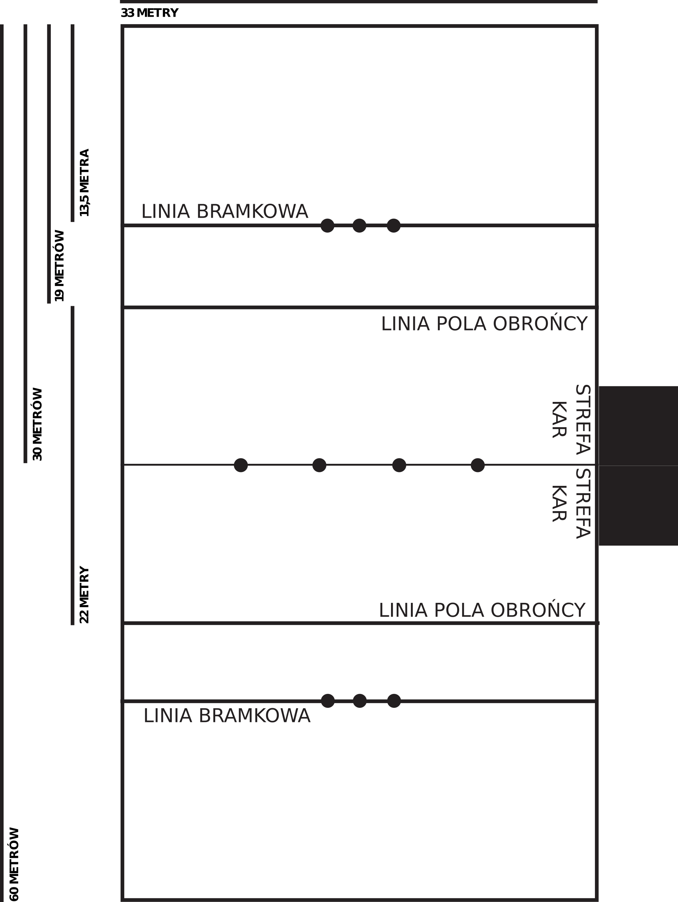
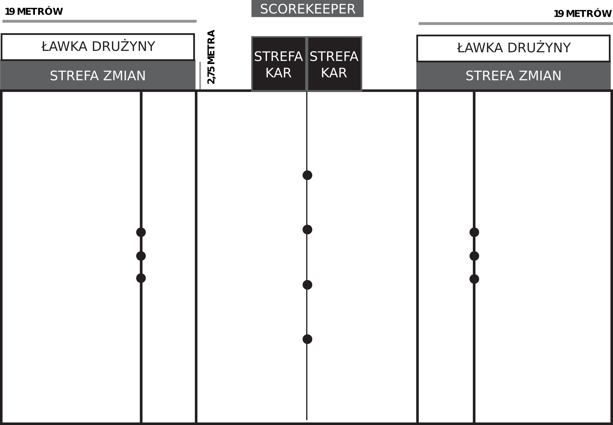

# Drużyna i ławka rezerwowych

## Kapitan oraz personel drużyny

### Obowiązkowy _speaking captain_
Każda drużyna musi wyznaczyć jedną osobę, która będzie
wpisana w oficjalny roster, aby pełniła rolę
_speaking captain_ podczas gry.

* _Speaking captain_ może rozmawiać z
  sędziami w imieniu całej drużyny.
    * Zawodnicy mogą rozmawiać z sędziami w
    swojej sprawie.
    * Sędziowie mogą nakazać dowolnej osobie
    zaprzestania mówienia do dowolnego sędziego.
* Jeśli wyznaczony _speaking captain_ nie jest w
  stanie kontynuować swoich obowiązków, z dowolnego względu,
  drużyna musi wybrać jego zastępcę.
    * Jeśli poprzedni _speaking captain_ legalnie
    powróci na boisko lub ławkę rezerwowych, na powrót
    przejmuje obowiązki _speaking captain_.
* _Speaking captain_ nie może wejść na boisko,
  jeśli gra nie została zatrzymana, chyba że wchodzi jako 
  zawodnik.
    * Jeśli _speaking captain_ znacząco wejdzie na
    boisko lub wpłynie na grę w jakikolwiek sposób będąc
    nielegalnie na boisku, liczy się to jako wtargnięcie na
    boisko.
  

\bluecard{Wtargnięcie na boisko}

### Personel drużyny
Niegrający członkowie drużyny, włączając niegrających
coachów, to personel drużyny.

* Organizatorzy turnieju mogą ograniczyć liczbę
  członków personelu drużyny, którzy mogą przebywać
  wewnątrz strefy graczy.
    * Ograniczenie musi pozwolić na conajmniej trzech
    członków personelu drużyny.
* Personel drużyny nie może wejść do gry.
* Jeśli członek personelu drużyny zrobi coś co
  skutkowałoby karą dla zawodnika rezerwowego, to ten
  członek personelu musi dostać tę samą karę.
* Personel drużyny nie może wchodzić na boisko jeśli
  gra nie jest zatrzymana.
    * Jeśli członek personelu drużyny znacząco wejdzie
    na boisko lub wpłynie na grę w jakikolwiek sposób będąc
    nielegalnie na boisku, liczy się to jako wtargnięcie
    na boisko.
  

\bluecard{Wtargnięcie na boisko}

## Roster i zawodnicy

### Roster

* Drużyna składa się z minimum siedmiu i maksymalnie
  21 zawodników.
    * Drużyna musi mieć siedmiu zdolnych do gry zawodników, aby rozpocząć lub kontynuować grę.
        * Jeśli drużyna nie będzia miała conajmniej siedmiu zdolnych do gry zawodników w dowolnym momencie gry, taka drużyna musi się poddać.
    
  

\penaltyd{Poddanie się}{Drużyna nie posiada 7 zawodników zdolnych do gry}

### Pozycje

* Drużyna ma jednego obrońcę w grze.
    * Obrońcy muszą nosić zieloną opaskę na czole.
    * Obrońcy mogą używać kafla na każdy legalny sposób.
* Drużyna ma trzech ścigających w grze.
    * Ścigający muszą nosić białą opaskę na czole.
    * Ścigający mogą używać kafla na każdy legalny sposób.
* Drużyna ma dwóch pałkarzy w grze.
    * Pałkarze muszą nosić czarną opaskę na czole.
    * Pałkarze mogą używać tłuczków na każdy legalny sposób.
* Podczas uziemienia szukających, drużyna nie może mieć szukającego w grze. Po zakończeniu uziemienia szukających, drużyna musi mieć szukającego w grze.
    * Szukający muszą nosić żółtą opaskę na czole.
* Zawodnicy poza grą są zawodnikami rezerwowymi.
    * Zawodnicy rezerwowi nie mają przypisanej pozycji.
    * Zawodnicy rezerwowi nie muszą mieć na głowie żadnej opaski.
* Zawodnicy w strefie kar uznawani są jako w grze i liczą się do wymogów pozycji dla swojej drużyny.
* Nie można ukarać drużyny za chwilowe niespełnienie wymogów pozycji ze względu na zmianę zawodników lub jeśli szukający zagapi się i nie wejdzie na boisko po zakończeniu uziemienia szukających.

\yellowcard{(_Speaking captain_) Nieprzestrzeganie wymogów pozycji w grze}

\yellowcard{(_Speaking captain_) Umyślne niewystawienie szukającego do gry}

### Zasada gender

* Drużyna może mieć conajwyżej czterech zawodników identyfikujących się z daną płcią w grze, w tym samym czasie.
    * Zawodnik przebywający w strefie kar uznawany jest jako w grze.
* Płeć z jaką zawodnik się identyfikuje uznawana jest za płeć tego zawodnika.
* Jeśli drużyna nie może wystawić pełnego zestawu zawodników, bo nie spełniłaby zasady gender, to może kontynuować grę z mniejszą ilością zawodników na boisku.
    * Drużyna nie może rozpocząć gry, jeśli nie spełnia wymogów pełnego zestawu zawodników.
    * Posiadanie jednego obrońcy, jednego pałkarza i jednego ścigającego w grze jest obowiązkowe, nawet jeśli drużyna wystawia mniej niż siedmiu zawodników.
        * Wliczamy w to zawodników w strefie kar.
        * Po zakończeniu uziemienia szukających, posiadanie jednego szukającego jest również obowiązkowe.
    * Jeśli drużyna odzyska możliwość wystawienia pełnego zestawu zawodników to musi to zrobić.
        * W tym przypadku zawodnik wchodzi na boisko z ławki rezerwowych.
    

\yellowcard{(_Speaking captain_) Nieprzestrzeganie wymogów zestawu zawodników w grze}

### Poprawianie niewłaściwego zestawu zawodników
Kiedy _speaking captain_ otrzyma karę za nieprzestrzeganie wymogów zestawu zawodników w grze, drużyna musi naprawić sytuację jak najmniejszą liczbą zmian zanim gra zostanie wznowiona.

## Zmiany

### Procedura zmiany
Aby wymienić zawodnika z rezerwowym kiedy gra nie jest wstrzymana muszą nastąpić poniższe:

* Zawodnik schodzący z boiska nie jest zbity.
* Zawodnik schodzi z boiska w strefie zmian swojej drużyny, a następnie schodzi z miotły.
    * Zawodnik nie może zejść z miotły zanim opuści boisko.
    * Zawodnik, który zszedł z miotły aby się zmienić, nie może już być zbity.
* Wszelkiego rodzaju wymiana sprzętu (również opasek) musi się odbyć poza boiskiem.
* Zawodnik rezerwowy wchodzący do gry wsiada na miotłę w strefie zmian i wchodzi na boisko zanim będzie mógł wejść w interakcję z grą.
    * Zawodnik rezerwowy wchodzi na boisko mniej więcej w tym samym miejscu, gdzie zmieniający się zawodnik z niego zszedł.
    * Zmiana jest zakończona gdy zawodnik przekroczy krawędź boiska i dotyka tylko ziemi na boisku.
        * W tym momencie zawodnik może zacząć interakcje z grą i może zostać zbity.
* Wchodzący na boisko zawodnik dostaję karę jeśli niewłaściwie przeprowadzono zmianę.
* Jeśli zawodnik wejdzie na boisko po niewłaściwym przeprowadzeniu zmiany, ale jeszcze nie wejdzie w interakcję z grą, sędzia powinien nakazać mu powtórzenie procedury.
    * Jeśli zawodnik wejdzie w interakcję z grą przed decyzją sędziego lub przed powtórzeniem procedury, musi być ukarany za nielegalną zmianę.
    * Zawodnik, który wielokrotnie nieprzestrzega procedury zmiany, musi być ukarany za nielegalną zmianę.

\penaltyd{Powtórz procedurę}{Niewłaściwe przeprowadzenie zmiany}

\bluecard{Nielegalna zmiana}

### Zmiana pozycji
Zawodnicy mogą wymienić się pozycjami przez przeprowadzenie procedury zmiany i wymianę opasek, po tym jak zeszli z mioteł w strefie zmian.

* Kiedy zawodnicy się wymieniają opaski to obserwujemy dwie oddzielne zmiany. Schodzą z boiska jako zawodnik starej pozycji i wchodzą jako zawodnik nowej pozycji.

### Zasady zmian

* Zmiany mogą być przeprowadzane tylko kiedy gra nie jest wstrzymana, z poniższymi wyjątkami:
    * Zmiana zawodnika usuniętego z boiska z boiska (patrz \myref{9.1.6}).
    * Zmiana zawodnika kontuzjowanego (patrz \myref{1.3.4})
    * Obrońca zamienia się pozycją z innym zawodnikiem kiedy idzie do strefy kar (patrz \myref{9.4.2}).
    * Zamiana zawodnika z rezerwowym, który popełnił faul (patrz \myref{9.4.5}).
    * Poprawianie niewłaściwego zestawu zawodników po otrzymaniu kary (patrz \myref{1.2.4}).
  

### Zmiana z powodu kontuzji

* Jeśli zawodnik dozna kontuzji ale gra nie została wstrzymana, to aby się zmienić musi przejść procedurę zmiany (patrz \myref{1.3.1}).
* Gra musi zostać wstrzymana jeśli zawodnik krwawi lub leży i jest zbyt mocno kontuzjowany aby kontynuować grę lub się zmienić.
    * Gra powinna zostać wstrzymana natychmiast jeśli kontuzjowany zawodnik znajduje się w pobliżu akcji lub został poważnie kontuzjowany, włączając w to niepowierzchowne urazy głowy.
    * Jeśli kontuzja nie jest poważna, a zawodnik nie przeszkadza w dalszym rozegraniu akcji, sędzia główny powinien pozwolić grze na kontynuację, dopóki jej zatrzymanie nie będzie powodowało przewagi dla którejś z drużyn lub gra zbliży się do kontuzjowanego zawodnika.
* Jeśli gra została wstrzymana i zawodnik jest kontuzjowany:
    * Kontuzjowany zawodnik może opuścić boisko i zostać zastąpionym przez zawodnika rezerwowego.
        * Jeśli gra została wstrzymana z powodu kontuzji zawodnika, to musi on opuścić boisko.
        * Jeśli zawodnik krwawi, musi opuścić boisko.
            * Krwawiący zawodnik nie może powrócić do gry, dopóki nie otrzyma pozwolenia od sędziego, który uzna, że krwawienie ustało.
        * Miotła kontuzjowanego zawodnika pozostaje na boisku tam gdzie była gdy gra została wstrzymana.
    * Kontuzjowany zawodnik, który opuszcza boisko musi być zastąpiony dowolnym rezerwowym zdolnym do gry.
        * Podczas wstrzymania gry, rezerwowy zamienia zawodnika w miejscu oznaczonym przez jego miotłę.
        * Jeśli nie ma żadnych rezerwowych, spełniających zasadę gender, drużyna może grać o jednego zawodnika mniej.
            * Jeśli to by oznaczało, że na danej pozycji nie ma żadnego zawodnika, to inny zawodnik musi zająć pozycję i miejsce na boisku kontuzjowanego zawodnika.
        * Jeśli zawodnik jest zmuszony przez zasadę do opuszczenia boiska, ale ma lekką kontuzję i może grać dalej, a nie ma stosownych rezerwowych, to zawodnik ten może wziąć miotłę i kontynuować grę od granicy strefy zmian.
* Zawodnik nie może symulować kontuzji.

\yellowcard{Symulowanie kontuzji}

### Zmiany między etapami gry
Drużyny mogą robić dowolnie wiele zmian między etapami gry nie wykonując procedury zmiany.

* Zawodnik przebywający w strefie kar nie może zostać zmieniony między etapami gry.
* Jeśli zawodnik otrzyma kartkę za faul popełniony po tym jak sędzia główny oznajmił koniec etapu gry, to ta kara powinna zostać potraktowana jako kara dla zawodnika rezerwowego, a _speaking captain_ może wybrać pozycję, na której faulujący zawodnik odbędzie karę.

\yellowcard{(_Speaking captain_) Nielegalna zmiana między etapami gry}

## Strefa zmian i ławka drużyny

### Ograniczenia ławki drużyny i strefy zmian

* Wszelkie zmiany muszą odbyć się w strefie zmian, a nie w ławce drużyny.
* Zawodnicy rezerwowi i personel drużyny muszą przebywać na ławce drużyny lub strefie zmian kiedy gra nie jest wstrzymana i nie mogą tłumić się przy granicy boiska o ile nie będą za chwilę się zmieniać.
    * Jeśli drużyna wielokrotnie tłumi się przy granicy boiska, sędziowie mogą nakazać rezerwowym pozostanie tylko na ławce drużyny, o ile zaraz taki zawodnik nie będzie się zmieniał.
* Wszelkiego rodzaju sprzęt, który nie jest niezbędny do gry, musi pozostać na ławce drużyny.
    * Wszelkie dodatkowe piłki drużyny mogą znajdować się na ławce, ale muszą być schowane w torbie lub innym pojemniku.
  

### Opuszczanie strefy zmian, ławki lub strefy graczy

* Jeden zawodnik rezerwowy lub członek personelu drużyny może opuścić strefę zmian lub ławkę drużyny, aby sprawdzić czas lub wynik, ale nie może przeszkadzać _timekeeperowi_ i _scorekeeperowi_ w ich obowiązkach, ani wejść na boisko.
* _Speaking captain_ może opuścić strefę graczy, aby porozumieć się z organizatorami turnieju.
* Każdy kto potrzebuje pomocy medyków może opuścić strefę graczy, aby ją otrzymać.
    * Każdy zawodnik, który opuści w ten sposób strefę graczy, może wrócić do gry jeśli medycy uznają, że może.
    * Jeśli zajdzie taka potrzeba, to _speaking captain_ może wyznaczyć osobę, która opuści strefę graczy, aby pomóc kontuzjowanemu zawodnikowi.
    * W przypadku urazu głowy zawodnika, sędzia główny może nakazać mu opuszczenie strefy gry, aby zasięgnąć pomocy medyków.
* Celowe nielegalne opuszczenie strefy zmian lub ławki drużyny, mające na celu obejście zasad to nielegalne obejście.

\bluecard{Nielegalne obejście}

### Przeszkadzanie przy liniach bocznych
Zawodnicy rezerwowi nie mogą przeszkadzać grze przy liniach bocznych.

* Rezerwowy przeszkadza przy linii bocznej jeśli bezpośrednio oddziaływuje na grę i zachodzi jedno z poniższych:
    * Rezerwowy jest nielegalnie i celowo poza strefą zmian i ławką drużyny.
    * Rezerwowy nie usiłował odsunąć się, aby uniknąć interakcji z grą.
  

\bluecard{Przeszkadzanie przy liniach bocznych}

\redcard{Celowe przeszkadzanie przy liniach bocznych}

# Sprzęt i wymiary boiska

## Linie i oznaczenia boiska

### Linie granic
Boisko składa się z czterech granic, które tworzą prostokąt 33m na 60m.

* Linie granic długości 33m to linie końcowe.
* Linie granic długości 60m to linie boczne.
    * Linia boczna najbliższej stołu _scorekeepera_ to ,,linia boczna _scorekeepera_''.
  

### Linia środkowa
Linia środkowa łączy środki linii bocznych.

### Linie pól obrońców
Są dwie linie wyznaczające pola obrońców, równoległe do linii końcowych, łączące linie boczne i usytuowane 11 metrów od linii środkowej, po obu jej stronach.

### Linie bramkowe
Są dwie linie bramkowe, równoległe do linii końcowych, łączące linie boczne i usytuowane 16,5 metra od linii środkowej, po obu jej stronach.

### Strefy kar
Każda drużyna ma strefę kar poza boiskiem.

* Każda strefa kar to kwadrat o boku 5,5 metra, zaczynający się na linii środkowej i ciągnący w stronę ławki drużyny przy linii bocznej _scorekeepera_.

### Pozycje piłek
Na linii środkowej są oznaczone cztery pozycje piłek.

* Pierwsze dwie piłki są położone 2,75m po obu stronach linii środkowej.
* Kolejne dwie piłki są położone 8,25m po obu stronach linii środkowej.

### Strefy zmian
Strefa zmian to prostokąt 19m na 2,75m poza boiskiem graniczący z polem obrońcy drużyny po stronie linii bocznej _scorekeepera_.

### Ławki drużyn
Ławka drużyny to prostokąt 19m na 2,75m przylegający dłuższym bokiem do strefy zmian drużyny i dotykający granicy strefy gracza.

### Strefa graczy
Strefa graczy to prostokąt, który po środku ma boisko.

* Prostokąt ten ma wymiary 44m na 66m.
* Strefa graczy nie może zawierać żadnych przeszkód ani niebezpiecznego terenu.
    * Żadne elementy turniejowe, np. stół _scorekeepera_, nie mogą być ustawione wewnątrz strefy graczy.
* Podczas gry strefa graczy jest zarezerwowana dla:
    * Zawodników grających drużyn, którzy byli oficjalnie wpisani na listę zawodników.
    * Sędziów przypisanych do danej gry.
    * Organizatorów turnieju, którzy otrzymali uprawnienia (na swoje ryzyko) od sędziego głównego lub dyrektora turnieju.
    * Personel drużyny zgodnie z opisem w \myref{1.1.2}.
* Widzowie nie mogą wchodzić do strefy graczy.

### Oznaczenia boiska
Poszczególne części boiska i otaczającej strefy powinny być oznaczone w jasny sposób. Te oznaczenia zazwyczaj robi się rysując linie lub stawiając znaczniki stożkowe.

* Poniższe muszą być oznaczone:
    * Granice boiska (\myref{2.1.1}).
    * Linia środkowa (\myref{2.1.2}).
    * Linie pól obrońców (\myref{2.1.3}).
    * Pozycja piłki najbardziej oddalona od stołu _scorekeepera_ (\myref{2.1.6}).
* Poniższe oznaczenia są opcjonalne, ale zalecane:
    * Linie bramkowe (\myref{2.1.4}).
    * Strefy kar (\myref{2.1.5}).
    * Pozostałe pozycje piłek (\myref{2.1.6}).
    * Ławki drużyn (\myref{2.1.8}).
    * Strefa graczy (\myref{2.1.9}).
    * Pozycje pętli (\myref{2.2.3}).
        * Te oznaczenia nie mogą wpływać na stabilność pętli.
    
  

## Pętle

### Konstrukcja pętli

* Każda pętla musi się składać ze słupa i okgrągłej obręczy na szczycie słupa. Materiał ich wykonania może być dowolny, poza metalem i cementem, i nie może stanowić zagrożenia dla zawodników.
* Pętla może być umieszczona na podstawce, aby stała pionowo.
    * Niezależnie od wysokości podstawki, pętla musi mieć określoną wysokość.
    * Podstawka może zawierać metalowe mocowania, ale nie może być wykonana z metalu lub cementu.
* Pętle muszą samodzielnie stać i wytrzymać grę.
    * Sędziowie muszą odmówić gry na pętlach lub podstawkach, które ich zdaniem są niebezpieczne dla graczy.
  

### Kształt pętli

* Każdy zestaw pętli ma trzy słupy o różnych wysokościach.
    * Te wysokości to 0,91m, 1,37m, 1,83m.
* Obręcz musi być zamocowana do szczytu każdego słupa.
    * Wewnętrzna średnica obręczy musi wynosić między 81cm, a 86cm.
    * Mocowanie obręczy do słupa nie może spowodować, że słup będzie wyższy niż jego wymagana wysokość.
  

### Pozycje pętli

* Trzy pętle są umieszczone na linii bramkowej.
    * Najwyższa pętla (1,83m) musi być umieszczona na środku linii bramkowej.
    * Pozostałe dwie pętle umieszczane są na linii bramkowej w odległości 234cm po obu stronach najwyższej pętli.
    * Patrząc na pętle ze środka boiska, mała pętla (0,91m) musi być po lewej stronie, a średnia (1,37m) po prawej stronie.
* Obręcze pętli muszą być ustawione wzdłuż linii bramkowej.

## Piłki

### Kafel
Kafel musi spełniać poniższe:

* Być piłką do siatkówki.
* Mieć między 65cm a 67cm w obwodzie.
* Kafel musi zachowywać okrągły kształt, nie może być w pełni napompowany, ani tak spompowany, aby zawodnik był w stanie złapać wałek pokrycia jedną ręką.

### Tłuczki
Trzy tłuczki muszą spełniać:

* Być okrągłą piłką zrobioną z elastycznego, gumowego lub podobnego tworzywa (np. dodgeball).
* Mieć 22cm w średnicy i 68cm w obwodzie.
* Tłuczki muszą zachowywać okrągły kształt, nie mogą być w pełni napompowane, ani tak spompowane, aby zawodnik był w stanie złapać wałek pokrycia jedną ręką.

### Ogonek zniczowy
Ogonek zniczowy powinien spełniać:

* Być piłką tenisową w skarpecie.
    * Skarpeta musi mieć widoczną długość między 25cm i 30cm.
        * Jeśli skarpeta jest przyczepiona do zewnątrz spodenek (np. rzepem) to maksymalnie 5cm elementu przyczepienia może się liczyć do minimalnej długości skarpety.
* Skarpeta musi być przyczepiona do spodenek znicza lub włożona za spodenki tak, żeby nie wypadała i pozwalała na odłączenie od spodenek przez szukającego.

### Uszkodzone piłki w trakcie gry
Jeśli piłka zostanie uszkodzona w trakcie gry (np. zejdzie z niej powietrze lub pęknie), to sędzia główny musi wstrzymać grę i naprawić lub wymienić piłkę. Należy stosować poniższe:

* Sędzia główny zatrzymuje grę od razu jak tylko piłka zostanie uszkodzona.
* Jeśli piłka została uszkodzona w trakcie lotu, to naprawiona lub wymieniona piłka trafia do zawodnika, który jako ostatni miał tę piłkę w posiadaniu, z wyłączeniem kafla po uznanym golu.
    * Jeśli ten zawodnik spadł z miotły przed zatrzymaniem gry, to piłka jest przekazywana najbliższemu nadającemu się do tego zawodnikowi z tej samej drużyny.
        * Jeśli takiego zawodnika nie ma, to piłka zostaje położona w miejscu gdzie ten zawodnik się znajduje.
* Nie można zdobyć bramki ani kogoś zbić jeśli sędzia stwierdził uszkodzenie piłki przed zbiciem lub golem.
* Jeśli tłuczek zostanie uszkodzony w momencie zbicia, to zbicie się liczy, a tłuczek staje się martwy.
    * Jeśli tłuczek zostanie uszkodzony podczas ostatniego ruchu prowadzącego do jego złapania, to to złapanie się liczy.
* Jeśli ogonek zniczowy zostanie uszkodzony podczas łapania (np. skarpeta przerwie się na pół), to złapanie się liczy jeśli szukający czysto zerwał piłkę.
    * Jeśli ogonek zniczowy został uszkodzony przed złapaniem to złapanie to nie jest dobre.
  

## Miotły

### Przepisy dotyczące mioteł
Każdy zawodnik w grze musi mieć miotłę. Miotła spełnia poniższe:

* Składa się z plastikowej rurki.
    * Ta rurka ma długość między 81cm i 107cm.
* Nie może mieć drzazg ani ostrych elementów.
    * Jeśli miotła jest pusta w środku, to oba końce muszą zostać zakryte (np. zaklejone).
* Nie może być przyczepiona do ciała, ubrań lub innego sprzętu zawodnika.

### Złamane miotły
Jeśli miotła się złamie lub zepsuje podczas gry, sędzia główny musi natychmiast przerwać grę i wymienić miotłę, zanim gra będzie kontynuowana.

* Rozpoczęcie zagrania z zepsutą miotłą, jeśli jest się tego świadomym, jest nielegalne.

\redcard{Świadome rozpoczęcia zagrania z zepsutą miotłą}

### Zapewnianie mioteł
Organizatorzy turnieju muszą zapewnić co najmniej 10 identycznych mioteł obu drużynom. Drużyna może przyjść z własnym zestawem mioteł, o ile nie jest to zabronione przez regulacje wydarzenia, ustalone przed rozpoczęciem wydarzenia.

## Sprzęt zawodników

### Bezpieczeństwo
Zawodnicy nie mogą używać sprzętu lub nosić na sobie czegoś, co stanowi zagrożenie dla nich lub innych zawodników.

* Zawodnicy nie mogą mieć długich lub ostrych paznokci. Czy dane paznokcie są dopuszczalne decyduje sędzia główny. Paznokcie widoczne gdy patrzymy na wewnętrzną część dłoni są uznawane za długie.

\bluecard{Wejście do gry z za długimi lub ostrymi paznokciami}

### Obowiązkowy sprzęt
Podczas gry zawodnicy muszą mieć na sobie poniższe:

* Kolorową opaskę, która musi być widoczna na czole, określającą pozycję zawodnika.
* Koszulkę.
    * Koszulki zawodników z jednej drużyny muszą być tego samego koloru i jasno odróżnialne od koszulek przeciwnej drużyny.
    * Głównym kolorem koszulki nie może być żółty lub złoty.
    * Koszulka nie może mieć głównie pionowych biało-czarnych pasów.
* Spodenki lub spódniczka.
    * Główny kolor najbardziej zewnętrznego ubrania nie może być żółty lub złoty.
    * Trzeba mieć bieliznę pod spodenkami lub spódniczką.
* Buty lub korki.
    * Korki nie mogą być ostre.
    * Korki nie mogą być z metalu lub zakończone metalem.
* Ochraniacz na zęby, który spełnia:
    * Posiada część międzyzębową (occlusal).
    * Posiada część przednią, chroniącą zęby (labial).
    * Pokrywa tylne zęby odpowiednią grubością.
  

\bluecard{Wejście na boisko bez wymaganego sprzętu}

\bluecard{Celowe pozbycie się wymaganego sprzętu w trakcie gry}

### Wymagania opasek
Opaski oznaczające pozycje zawodników muszą spełniać poniższe:

* Kolor opaski musi być wystarczająco rozróżnialny, żeby jednoznacznie określić pozycję gracza.
* Opaska musi być łatwo widoczna z pewnego dystansu i widoczna spośród włosów lub innego sprzętu zawodnika.
* Czapki lub inne nakrycia głowy nie mogą stanowić opaski.
    * Opaska musi być noszona na nakryciu głowy, a kolor nakrycia musi być wyraźnie różny od koloru opaski.
    * Nakrycie głowy, które przypomina opaskę i jest koloru opaski, może być użyte jako opaska.
        * Właściwa opaska nie może być noszona na takim nakryciu głowy.
* Jeśli zawodnik zgubi opaskę w trakcie gry, może kontynuować grę bez niej. Kiedy następi dowolne z poniższych to musi założyć z powrotem opaskę.
    * Zostanie zbity.
    * Gra zostanie wstrzymana.
    * Zdobyto bramkę.
        * Szukający i pałkarze nie muszą poprawiać opaski kiedy zdobyto bramkę.
* Jeśli sędzia uzna opaskę zawodnika za niedopuszczalną, z dowolnego powodu, to musi on natychmiast naprawić sytuację.
    * Jeśli z jakiegoś powodu nie jest to możliwe, stosowana jest procedura przypadkowego naruszenia sprzętu (patrz \myref{2.5.7}).
  

\penaltyd{Powrót do pętli}{Nie poprawienie opaski po jej zgubieniu}

### Numery na koszulkach
Każdy zawodnik musi mieć z tyłu na koszulce liczbę z zakresu 0 do 99 włącznie. Numer zawodnika musi być jasno widoczny.

* Numer nie może mieć więcej jak dwie cyfry, włączając w to poprzedzające zera.
* Żadnych dwóch zawodników z jednej drużyny nie może mieć takiego samego numeru.
    * Poprzedzające zera są pomijane przy określaniu numeru zawodnika.
    * Jeśli drużyna zostanie ukarana za posiadanie dwóch zawodników o tym samym numerze, _speaking captain_ musi wyznaczyć zawodnika, który zmieni swój numer.
        * Wyznaczony gracz, nie może brać udziału w grze dopóki na jego plecach nie wyznaczony zostanie nowy numer i numer ten zostanie przekazany _scorekeeperowi_.
* Jeśli numer zawodnika dozna usterki podczas gry, tak że nie da się go rozpocznać:
    * Gra nie jest wstrzymana.
    * Sędzia informuje zawodnika o usterce.
    * Zawodnik musi naprawić numer podczas najbliższego wstrzymania gry lub zejściem z boiska na zmianę.
        * Jeśli gra jest wstrzymana, a numeru nie można naprawić szybko, zawodnik musi zostać zmieniony podczas tej przerwy.
        * Jeśli sytuację można naprawić wyłącznie nadając zawodnikowi nowy numer, to numer ten musi zostać zgłoszony _scorekeeperowi_.
* Żaden zawodnik nie może wejść do gry bez legalnego i czytelnego numeru na plecach.

\bluecard{Wejście do gry bez legalnego i czytelnego numeru na plecach}

\bluecard{(_Speaking captain_) Posiadanie dwóch graczy o tym samym numerze w strefie graczy}

### Dodatkowy sprzęt
Poniższe elementy określone są jako dodatkowy sprzęt i mają pewne ograniczenia.

* Ochraniacze.
    * Maksymalna grubość wynosi 2,5cm.
    * Musi przechodzić test ,,pukania'' -- jeśli sędzia zapuka knykciem w ochraniacz, nie powinno być żadnego dźwięku.
    * Musi zginać się łatwo przy minimalnej ilości siły.
* Ortezy -- muszą spełniać wymagania dla ochraniaczy.
    * Orteza może zawierać twarde elementy, ale muszą one być pokryte i przechodzić test "pukania".
    * Jeśli twarde elementy zostaną odsłonięte podczas gry, zawodnik musi opuścić boisko i naprawić problem (patrz \myref{2.5.7})
    * Sędziowie mogą zabronić ortez, które ich zdaniem będą stanowić zagrożenie dla osób na boisku.
* Wspomagacze atletyczne (np. na miejsca intymne) są dozwolone.
* Okulary -- gracze mogą nosić okulary.
    * Okulary nie mogą być ze szkła, chyba że noszone są pod goglami.
    * Gogle z metalu, np. jak do lacrosse, nie są dozwolone.
* Rękawice -- muszą spełniać wymagania dla ochraniaczy.
* Dodatkowy sprzęt na ramieniu -- tylko rękawy, rękawice i ortezy mogą być noszone na przedramieniu.
* Specjalistyczny sprzęt -- osoby leczące kontuzje, potrzebujące specjalistycznego sprzętu muszą dostać pozwolenie aby go używać od zarządców ligi przed turniejem.
* Każdy inny sprzęt musi być zaakceptowany przez sędziego głównego przed meczem. Sprzęt, który zostanie uznany przez sędziego za niebezpieczny lub niefair dla jednej z drużyn, będzie niedopuszczony.

\bluecard{Nielegalne użycie dodatkowego sprzętu w grze}

### Dopuszczanie dodatkowego sprzętu
Ochraniacze, ortezy i specjalistyczny sprzęt muszą być zaprezentowane do akceptacji sędziemu głównemu lub wyznaczonemu sędziemu przed każdą grą, niezależnie od tego czy było przeprowadzane sprawdzanie sprzętu.

\redcard{Używanie zabronionego sprzętu}

### Przypadkowe naruszenie zasad sprzętu
Jeśli podczas gry sprzęt zawodnika, który był legalny ulegnie zmianie stanu na nielegalny:

* Gra nie jest wstrzymywana, chyba że sędzia stwierdzi, że naruszenie sprzętu stwarza zagrożenie dla zawodników.
* Zawodnik musi opuścić boisko i poprawić naruszenie od razu. Może zmienić się na ten czas z zawodnikiem rezerwowym.
    * Zawodnicy nie muszą opuszczać boiska by naprawić zepsutą miotłę.
* Zawodnik, który opuści boisko nie może wrócić dopóki nie poprawi naruszenia sprzętu.
    * Obowiązkowy sprzęt musi zostać wymieniony lub naprawiony.
        * Jeśli nie ma zamienników dla miotły lub opaski, sędzia główny wstrzymuje grę aż odpowiedni sprzęt zostanie zapewniony.
* Jeśli zawodnik nie opuści boiska będąc poinformowanym przez sędziego o naruszeniu sprzętu lub wejdzie na boisko bez poprawienia naruszenia, musi zostać ukarany za ignorowanie polecenia sędziego.

\yellowcard{Ignorowanie polecenia sędziego}

### Ograniczenia sprzętu specyficzne dla lokalizacji
Organizatorzy turnieju mogą wyłączyć z użycia nieobowiązkowy sprzęt, aby zadowolić wymagania lokalizacji.

\redcard{Używanie sprzętu zakazanego przez organizatorów turnieju}

### Celowe modyfikowanie sprzętu
Nielegalne jest celowe modyfikowanie sprzętu, włączając w to piłki i pętle, w celu zdobycia przewagi nad innymi zawodnikami.

\redcard{Nielegalne celowe modyfikowane sprzętu}

### Zakazany sprzęt
Poniższe są zakazane i nie mogą być noszone przez zawodników w grze:

* Urządzenia nagrywające dźwięk i wideo.
* Biżuteria
    * Plastikowe substytuty kolczyków niewystające poza skórę są dozwolone.
* Substancje ułatwiające łapanie, które mogą zostać przeniesione na piłkę.

\redcard{Noszenie zakazanego sprzętu}

# Procedury gry

## Czynności przygotowawcze

### Spotkanie przed grą
Przed każdą grą, sędzia główny zwołuje reprezentantów obu drużyn, aby omówić ogólne zasady.

* Drużyna musi wybrać jedną osobę, która jako _speaking captain_, będzie ich
  reprezentowała podczas gry.
  
    * _Speaking captain_ musi być obecny na spotkaniu przed grą.
    * Dodatkowi reprezentanci drużyny również mogą uczestniczyć w spotkaniu.
* Podczas spotkania sędzia główny powinien poruszyć następujące tematy z reprezentatami drużyn:
    * Zasady specyficzne dla boiska.
    * Kto będzie zniczem.
    * Zawodnicy, o których sędziowie powinni wiedzieć na potrzeby zasady gender.
    * Pozostałe pytania i~zastrzeżenia uczestniczących stron dotyczące gry.
  

### Rzut monetą
Drużyny mogą poprosić o rzut monetą, aby określić, która z nich będzie atakować który zestaw pętli.

* Jeśli dowolna z drużyn poprosi o rzut monetą, sędzia główny i druga drużyna muszą się dostosować do prósby.
* Drużyna, która przejechała większą odległość aby dotrzeć na mecz wybiera stronę monety i ogłasza swój wybór kiedy moneta jest jeszcze w powietrzu.
* Drużyna, która wygrała rzut monetą wybiera zestaw pętli, na który będzie atakować w pierwszym etapie gry.

## Rozpoczynanie gry

### Procedura rozpoczęcia
Aby rozpocząć grę:

* Pierwszy skład drużyn musi ustawić się na linii startowej.
    * Każda drużyna musi zacząć grę z trzema ścigającymi, jednym obrońcą i dwoma pałkarzami.
    * Zawodnicy mogą ustawić się dowolnie w swoim polu obrońcy.
    * Zawodnicy mogą zimeniać ustawienie i opaski pozycji dopóki sędzia nie zawoła ,,Miotły w dół!''
    * Zawodnik, który otrzyma kartkę przed rozpoczęciem meczu (lub rezerwowy w przypadku czerwonej kartki) musi rozpocząć grę w strefie kar.
* Kafel i tłuczki muszą być umieszczone na określonych pozycjach (patrz \myref{2.1.6}).
    * Kafel musi zostać umieszczony na jednej z dwóch pozycji piłek najbliżej środka boiska.
    * Jakakolwiek piłka która poruszy się z jakiegokolwiek powodu musi zostać umieszczona z
    powrotem na swojej pozycji przed zawołaniem przez sędziego ,,Miotły w górę!''
  
* Sędzia główny potwierdza, że drużyny i sędziowie są gotowi.
* Sędzia główny woła ,,Miotły w dół!''
* Po zawołaniu ,,Miotły w dół!'':
    * Zawodnicy nie mogą się przemieszczać ani zamieniać opaskami.
    * Żadna część ciała zawodnika nie może dotykać ziemi za linią pola obrońcy.
        * Miotła zawodnika może przekraczać linię pola obrońcy.
    * Każdy zawodnik musi mieć miotłę w ręce.
        * Poza dłonią, miotła powinna leżeć płasko na ziemi, do momentu zawołania ,,Miotły w górę!''
* Sędzia główny woła ,,Gotowi!''
    * Zawodnicy mogą przyjąć pozycję startową po zawołaniu ,,Gotowi!'', ale miotła nadal musi pozostać płasko na ziemi.
* Kilka sekund po zawołaniu ,,Gotowi!'', sędzia główny woła ,,Miotły w górę!''
    * Na dźwięk ,,M'' w ,,Miotły w górę!'' zawodnicy muszą wejść na miotły i rozpocząć grę.
    * Jeśli pojawi się fałszywe zawołanie ,,Miotły w górę!'', sędzia główny resetuje zawodników i powtarza procedurę rozpoczęcia gry.
    * W przypadku faulu przed zawołaniem ,,Miotły w górę!'', sędzia główny daje zawodnikowi karę, resetuje zawodników i powtarza procedurę rozpoczęcia gry.
* Zawodnik popełnia falstart gdy:
    * Jego miotła jest w powietrzu w przed zawołaniem ,,Miotły w górę!''
    * Wyrusza za wcześnie i dotyka ziemi za linią pola obrońcy przed zawołaniem ,,Miotły w górę!''
  

\bluecard{Zmiana opaski po zawołaniu ,,Miotły w dół!''}

\bluecard{Zmiana lokalizacji w polu obrońcy po zawołaniu ,,Miotły w dół!''}

\bluecard{Falstart}

## Przerwy w grze

### Wstrzymywanie gry
Aby wstrzymać grę:

* Sędzia gwiżdże krótkie podwójne gwizdki.
* _Timekeeper_ zatrzymuje stopery liczący czas gry i wszystkie inne czasy.
* Zawodnicy będący aktualnie w grze muszą się zatrzymać, puścić swoje miotły i
  pozostać na pozycjach w których się zatrzymali.
  
    * Zawodnicy nie odkładają posiadanych piłek, chyba że nastąpiła strata na rzecz przeciwnej drużyny.
        * Zawodnicy nie mogą podnosić ani przesuwać piłek, które nie były w ich posiadaniu.
    * Zawodnicy, którzy zatrzymali się w nielegalnej pozycji muszą poprawić swoją pozycję.
    * Zawodnicy, którzy niecelowo i znacząco przesunęli się po gwizdkach, zostają cofnięci do miejsca, w którym byli w momencie wstrzymania gry.
  

\yellowcard{Celowe, nielegalne przesunięcie się podczas przerwy w grze}

\yellowcard{Celowe, nielegalne podniesienie lub przesunięcie piłki podczas przerwy w grze}

### Procedura wstrzymania
Kiedy gra zostanie wstrzymana:

* Sędzia główny konsultuje się z innymi sędziami w miarę potrzeby.
* Sędzia główny rozdaje kary za faule, komunikując rodzaj faulu do zawodników, _scorekeepera_ i widzów.
    * Każdy zawodnik ukarany kartką przechodzi do strefy kar.
    * Każdy zawodnik, który zostaje usunięty z boiska, opuszcza strefę graczy.
* Jeśli następuje przekazanie piłek, procedura przekazania powinna zostać wykonana
  przed ponownym rozpoczęciem gry.
* Jakiekolwiek wolne oraz żywe piłki, które były w powietrzu i niczego nie dotknęły przed
  gwizdkami (zawodnika, sprzętu, lub ziemi) są zwrócone do osób, które wprawiły je w ruch.
  
    * Ta zasada nie jest uwzględniana jeśli drużyna traci piłkę na rzecz przeciwnika.
    * Jeśli zawodnik, który wprawił piłkę w ruch nie spełnia wymagań aby ją otrzymać (np. jest zbity), piłka nie jest ruszana.
* Wolne piłki, które wyleciały za granice boiska po gwizdkach, są umieszczane przez sędziego dwa metry wewnątrz boiska od miejsca gdzie piłka opuściła boisko.
    * Piłka jest wewnątrz boiska i nie musi zostać wprowadzona do wewnątrz przez którąkolwiek z drużyn.
    * Ta zasada nie jest respektowana, jeśli piłka zostanie przeniesiona ze względu na inną zasadę.
* Wszelkie przeszkody z zewnątrz są usuwane.
* Wszelkie inne sprawy, włączając w to kontuzjowanych zawodników i uszkodzony sprzęt, zostają rozwiązane.
* Jeśli kafel jest martwy (w wyniku zdobycia gola) w momencie wznowienia gry, to przekazywany jest aktualnie broniącemu obrońcy.

### Wznawianie gry
Aby wznowić grę:

* Sędzia główny powiadamia zawodników, że gra zaraz będzie wznowiona zawołaniem ,,Na miotły!''
    * Zawodnicy muszą wsiąść na miotły dokładnie w miejscu, w którym byli gdy gra została wstrzymana.
    * Zawodnicy muszą stać w momencie zawołania ,,Na miotły!''
        * Jeśli dwóch lub więcej zawodników trzyma piłkę leżąc na ziemi w momencie wstrzymania gry i tak muszą wstać. Następnie mogą ponownie chwycić piłkę. Nie muszą koniecznie trzymać jej w ten sam sposób jak przed wstrzymaniem gry.
    * Zawodnicy mogą zmienić lekko pozycję aby przygotować się do startu, ale nie mogą popełnić falstartu.
        * Falstart zachodzi gdy zawodnik zrobi jedną z poniższych rzeczy przed gwizdkiem
      oznaczającym wznowienie gry:
      
            * Rozpocznie ruch rzucenia piłką.
            * Rozpocznie kontakt fizyczny.
            * Ruszy się ze swojego miejsca.
            * Spróbuje bezpośrednio wpłynąć na piłkę, która nie jest w jego posiadaniu.
        * Jeśli doszło do falstartu, gra pozostaje wstrzymana, a gracz zostaje cofnięty do poprzedniej pozycji.
        * Pierwszy falstart w czasie zatrzymania gry skutkuje ostrzeżeniem dla wszystkich zawodników na boisku.
            * Każdy kolejny falstart w czasie tego samego zatrzymania gry przez jakiegokolwiek
        gracza skutkuje karą.
      
    
  
* Sędzia główny wznawia grę pojedynczym krótkim gwizdkiem. Na ten gwizdek:
    * Gra zostaje wznowiona.
    * _Timekeeper_ wznawia czas gry oraz wszelkie stopery.
  

\penaltyd{Powrót do pętli}{Falstart podczas wznawiania gry}

### _Timeouty_

* Są dwa sposoby aby poprosić o _timeout_.
    * _Speaking captain_ może poprosić o _timeout_ podczas dowolnego wstrzymania podstawowego czasu gry.
    * _Speaking captain_ lub obrońca mogą poprosić o _timeout_ podczas gry, jeśli obrońca posiada kafel w swoim polu obrońcy i ma immunitet.
        * O ten rodzaj _timeoutu_ można poprosić tylko podczas pierwszych 17 minut czasu gry.
            * _Timekeeper_ musi jasno ogłosić moment 17 minuty czasu gry.
    * Jeśli żadne z powyższych warunków nie były spełnione, drużyna nie może otrzymać _timeoutu_.
    * Każda drużyna może poprosić o _timeout_ tylko raz w trakcie gry.
    * Kara za nielegalny _timeout_ może zostać nałożona tylko jeśli prośba o _timeout_ była
    celowo nielegalna albo jeśli sędzia zatrzyma grę lub spełni prośbę zanim zorientuje się, że
    _timeout_ był nielegalny.
  
* Kiedy _timeout_ jest zgłoszony właściwie:
    * Jeśli gra nie jest wstrzymana, sędzia główny musi ją wstrzymać.
        * Sędzia główny może minimalnie opóźnić wstrzymanie gry, aby poczekać na zakończenie się aktywnej gry pałkarzy.
    * Sędzia główny musi powiadomić _scorekeepera_ o zgłoszeniu _timeoutu_.
    * Po spełnieniu wszystkich kroków procedury zatrzymania (\myref{3.3.2}) rozpoczyna się jedno-minutowy _timeout_.
    * Sędzia główny powinien zagwizdać jeden długi gwizd po upływie 45 sekund _timeoutu_.
    * Po zakończeniu _timeoutu_ sędzia główny wznawia grę standardową procedurą (\myref{3.3.3}).
        * Każdy gracz, który nie wsiadł na miotłę na czas wznowienia gry, zostaje odesłany do pętli.
    
  

\bluecard{Nielegalne żądanie _timeoutu_}

## Regulowanie czasu gry

### Czas gry
Czas gry mierzony jest od momentu ,,M'' w ,,Miotły w górę!''

* Czas gry i wszelkie inne czasy z nim związane (np. kar) muszą zostać wstrzymane na czas przerw w grze i wznowione wraz ze wznowieniem gry.

### Uziemienie szukających
Uziemienie szukających to pierwsze 18 minut czasu gry podczas pierwszego etapu gry i 30 sekund drugiego etapu gry (dogrywki), podczas których znicz nie może zostać złapany.

* Uziemienie szukających musi być mierzone w czasie gry, a nie w czasie rzeczywistym.
* Podczas uziemienia szukających, nie biorą oni udziału w grze.
* Szukający z każdej drużyny musi stawić się u _timekeepera_ do 17 minuty czasu gry.
    * Szukający w czasie uziemienia są uznawani za zawodników rezerwowych i nie
    mogą wejść na boisko zanim nie zostaną wypuszczeni przez _timekeepera_.
    * Nie ma kary za niestawienie się do _timekeepera_ w wyznaczonym czasie. Aczkolwiek
    rozpoczynający szukający drużyny (czy to w głównym czasie gry czy w dogrywce) nie
    może wejść na boisko, jeśli nie zostanie wypuszczony przez _timekeepera_ z miejsca w ławce
    kar.
    
        * Rozpoczynający szukający drużyny, który wejdzie na boisko nie będąc wypuszczonym przez _timekeepera_ popełnia falstart szukającego i musi odsiedzieć karę jako szukający.
* Znicz musi wejść do strefy graczy między 17 i 18 minutą czasu gry.
* Po zakończeniu uziemienia szukających, _timekeeper_ wypuszcza szukających z ich stref kar.

\bluecard{Falstart szukającego}

## Etapy gry

### Kończenie etapu gry

* Pierwszy etap gry kończy się dobrym złapaniem znicza.
* Drugi etap gry (dogrywka) kończy się albo dobrym złapaniem znicza albo kiedy skończy się czas, którekolwiek nastąpi pierwsze.
* Trzeci etap gry (druga dogrywka) kończy się po pierwszym zdobytym punkcie przez drużynę.
* Sędzia główny lub sędzia zniczowy wstrzymują grę podwójnym gwizdkiem jeśli podejrzewają, że nastąpił koniec etapu.
    * Po konsultacji ze wszystkimi sędziami, i upewnieniu się że nie ma więcej wniosków, lub
    kar itd. w tym etapie gry oraz po potwierdzeniu, że etap się zakończył sędzia główny musi
    odgwizdać trzy długie gwizdki aby oznajmić koniec etapu gry.
    
        * Jeśli drużyny nie remisują, gra się kończy i wygrywa drużyna z większą ilością punktów.
        * Jeśli drużyny remisują, gra przechodzi do kolejnego etapu.
    
  

### Przejście do kolejnego etapu gry

* Jeśli drużyny zremisują na koniec pierwszego etapu gry, gra przechodzi do dogrywki.
* Jeśli drużyny zremisują podczas dogrywki, gra przechodzi do drugiej dogrywki.
* Zawodnicy odsiadujący czas kary, kontynuują karę w kolejnym etapie.
* Jeśli poprzedni etap zakończył się złapaniem znicza, to złapanie liczy się jako pojedynczy gol mogący sktukować wypuszczeniem zawodnika ze strefy kar (patrz \myref{9.4.1}).

### Dogrywka
Poniższa procedura musi zajść aby móc przejść do dogrywki.

* Drużyny zamieniają się połowami boiska.
* Sędziowie na nowo przygotowują boisko.
* Sędzia główny musi dać drużynom około trzech minut przerwy na odpoczynek między pierwszym i drugim etapem gry.
* Sędzia główny rozpoczyna grę zgodnie z procedurą rozpoczęcia (patrz \myref{3.2.1}).
* Znicz musi znaleźć się na boisku przed upływem 30 sekund czasu dogrywki.
* Zanim szukający będą mogli wystartować za zniczem, obowiązuje ich 30 sekundowe uziemienie szukających.
    * Przed zawołaniem ,,Miotły w górę!'' szukający powinni stawić się do _timekeepera_, aby być wypuszczonym po zakończeniu 30 sekundowego uziemienia szukających.
    * Jeśli czas kary szukającego nie zakończył się w poprzednim etapie, to jest kontynuowany dopiero po zakończeniu uziemienia szukających.
        * Szukający pozostaje w strefie kar i nie może wejść do gry na żadnej innej pozycji w trakcie uziemienia szukających.
        * Zdobyte punkty podczas uziemienia szukających nie wypuszczają szukającego.
* Dogrywka trwa 5 minut czasu gry lub do złapania znicza.
* Rola _timekeepera_ podczas dogrywki:
    * _Timekeeper_ musi ogłosić pozostały do końca czas po każdej pełnej minucie, która minęła
    w dogrywce (4, 3, 2, 1).
    * _Timekeeper_ musi ogłosić, że pozostało 30 sekund i 15 sekund.
    * _Timekeeper_ musi odliczyć na głos ostatnie 10 sekund.
    * Jeśli sędzia podniesie rękę sygnalizując przywilej korzyści lub opóźnioną karę, _timekeeper_ musi zatrzymać zegar zaraz po sygnale sędziego. Zegar musi pozostać
    zatrzymany dopóki faul nie zostanie ukarany.
  

### Druga dogrywka
Poniższa procedura musi zajść aby przejść do drugiej dogrywki.

* Drużyny nie zamieniają się połowami przed drugą dogrywką.
* Sędziowie od razu na naowo przygotowują boisko, a zawodnicy się ustawiają do rozpoczęcia gry.
* Sędzia główny rozpoczyna grę zgodnie z procedurą rozpoczęcia (patrz \myref{3.2.1}).
* Znicz pozostaje na linii środkowej aż do zawołania ,,Miotły w górę!''
* Nie ma uziemienia szukających. Szukający startują z pola obrońcy z resztą drużyny.
* Druga dogrywka trwa dopóki nie padnie bramka lub znicz nie zostanie poprawnie złapany.

## Poddanie gry

### Ogłoszenie poddania gry

* Sędzia główny musi ogłosić poddanie gry jeśli:
    * _Speaking captain_ oficjalnie zgłasza prośbę o poddanie gry.
    * Drużyna odmawia wznowienia odłożonej gry bez zgody przeciwnika oraz organizatorów
    turnieju.
    * Poddanie meczu jest formą ukarania jednej z drużyn.
* Gra może zostać ogłoszona jako poddana ze względu na naruszenie zasad ligi lub turnieju.
* W przypadku poddania:
    * Gra od razu się kończy oraz zostaje ogłoszona przegrana drużyny poddającej się.
    * Wszyscy zawodnicy powinni opuścić boisko.
  

## Odłożone gry

### Deklarowanie odłożonej gry

* Sędzia główny lub dyrektor turnieju może zadeklarować odłożenie gry ze względu na
  pogodę, kwestie bezpieczeństwa, niewłaściwe lub skrajnie złe zachowanie zawodników czy też
  ze względu na inne przeszkody zewnętrzne.
* Odłożona gra musi zostać zarejestrowana z bieżącym czasem gry, wynikiem,
  zawodnikami na boisku i posiadaniem piłek.
* Odłożone gry powinny zostać wznowione przy najbliższej możliwej i w pełni bezpiecznej
  okazji.

### Wznawianie odłożonej gry

* Jeśli którykolwiek z sędziów, którzy brali udział w grze przed jej odłożeniem, jest niedostępny to dyrektor turnieju lub sędzia główny wyznacza jego zastępcę.
* Wszyscy zawodnicy, którzy byli w grze w momencie jej zawieszenia rozpoczynają grę w
  swoich polach obrońcy.
  
    * Jeśli podczas wznowienia odłożenia gry, zawodnik, który był na boisku przed jej odłożeniem, nie jest
    aktualnie dostępny z jakiegokolwiek powodu, może zostać zastąpiony dowolnym innym
    zawodnikiem z rostera.
  
* Piłki muszą zostać przekazane zawodnikom, którzy je posiadali przed odłożeniem gry.
    * Piłki, które nie były w posiadaniu zawodników, w momencie zatrzymania gry, należy ułożyć na linii środkowej na pozycjach piłek, zaczynając od pozycji najbliżej środka.
        * Jeśli kafel nie był w posiadaniu i trafia na linię środkową to musi być na jednej z pozycji bliżej środka.
* Jeśli gra została odłożona po tym jak szukający zostali wypuszczeni, to startują oni ze swojego pola obrońcy, a znicz musi znajdować się na boisku przed wznowieniem gry.
    * Wszelkie ograniczenia nałożone na znicz przed odłożeniem gry, dalej obowiązują po wznowieniu gry.
* Sędzia główny woła ,,Miotły w dół!''
* Zawodnicy pozostają na swoich pozycjach z miotłami płasko na ziemi, tak jak przy standardowej procedurze (\myref{3.2.1}).
* Sędzia główny woła ,,Gotowi!''
* Sędzia główny woła ,,Miotły w górę!''
    * Na dżwięk ,,M'' w ,,Miotły w górę!'' zawodnicy rozpoczynają grę.
  

### Odrzucone gry

* Jeśli odłożona gra nie może zostać dokończona podczas tego samego turnieju, na którym się rozpoczęła, dyrektor turnieju musi ogłosić tę grę jako odrzuconą.
* Jeśli obaj _speaking captainowie_ oraz dyrektor turnieju wspólnie zadecydują o niekontynuowaniu odłożonej gry, wtedy dyrektor turnieju może ogłosić grę jako odrzuconą.
    * Jeśli jedna lub obie drużyny odmawiają wznowienia gry bez zgody przeciwnika i
    dyrektora turnieju, należy ogłosić, że ta drużyna lub drużyny deklarują poddanie gry.
  

# Zdobywanie punktów

## Zdobywanie bramek

### Dobry gol
Drużyna otrzymuje 10 punktów jeśli kafel przejdzie przez pętlę przeciwnika w całości, niezależnie od tego kto wprawił go w ruch, oraz gol zostanie potwierdzony przez sędziego.

* Poniższe warunki muszą być spełnione, aby uznać gol za dobry:
    * Cały kafel przeszedł przez jedną z pętli.
        * Można zdobyć bramkę z obu stron pętli.
    * Kafel nie był martwy.
    * Kafel nie był nieaktywny (patrz \myref{5.6.3}).
    * Gol nie nastąpił po faulu skutkującym kartką, popełnionym przez zawodnika drużyny atakującej, zanim zawodnik ten został ukarany.
    * Gol nie nastąpił po faulu skutkującym stratą piłki, popełnionym przez zawodnika drużyny atakującej, zanim piłka została przekazana.
    * Zawodnik strzelający gola nie popełnił faulu skutkującego powrotem do pętli, kartką lub usunięciem z boiska tuż przed otrzymaniem kafla lub w trakcie posiadania żywego kafla.
    * Pętla nie była przewrócona lub zniszczona (patrz \myref{4.3.1}).
* Kafel staje się martwy w momencie zdobycia dobrego gola.
* Sędzia główny musi potwierdzić dobry gol jednym długim gwizdkiem i podniesieniem obu rąk.
* Dobre gole zdobyte po poprawnym złapaniu znicza nie mogą być zaliczone (patrz \myref{4.4.3}).

### _Goaltending_

* Zagranie określone jest terminem _goaltending_ i liczy się jakby kafel przeszedł przez pętlę, jeśli zachodzi jedno z poniższych:
    * Zawodnik w swoim polu obrońcy, który nie jest obrońcą, dotyka kafla częścią siebie lub sprzętu przekładając ją przez pętlę od strony gdzie kafel wyleciałby z pętli.
    * Zawodnik w swoim polu obrońcy, który nie jest obrońcą, dotyka kafla częścią siebie lub sprzętu zasłaniając pętlę ze strony gdzie kafel wyleciałby z niej, ale nie przekładając tej części przez pętlę.
* Pałkarz lub szukający, który celowo popełnia _goaltending_ musi zostać ukarany.

\redcard{Celowy _goaltending_ pałkarza lub szukającego}

## Restartowanie po golu

### Martwy kafel
Po zdobyciu gola, zanim gra kaflem jest zrestartowana, kafel jest martwy.

* Dowolny ścigający z drużyny, która przed chwilą się broniła, może podać martwy kafel do swojego obrońcy, znajdującego się w swoim polu obrońcy, ale nie może z kaflem zrobić nic innego.
    * Rezerwowi mogą podać w ten sam sposób kafel do obrońcy, ale nie mogą opuścić strefy zmian lub ławki drużyny.
* Zawodnicy poprzednio atakującej drużyny nie mogą dotknąć kafla, chyba że obrońca poprzednio broniącej się drużyny o niego poprosi.
    * Poprzednio atakująca drużyna może odmówić podania kafla.
* Zawodnicy nie mogą być ukarani za grę jakby kafel był żywy przed potwierdzeniem bramki przez sędziego.
    * Ta zasada nie będzie brana pod uwagę jeśli sędzia stwierdzi, że zawodnik miał na celu opóźnienie restartu gry kaflowej.
* Poprzednio broniący się obrońca może poprosić sędziego o podanie kafla.
* Jeśli kara skutkuje stratą martwego kafla na rzecz poprzednio atakującej drużyny, to kafel stanie się żywy w momencie zrestartowania gry po przekazaniu kafla.

\bluecard{Celowa, nielegalna interakcja z martwym kaflem}

### Restartowanie obrońcy
Jeśli obrońca drużyny, która przed chwilą się broniła, jest pierwszą osobą posiadającą martwego kafla na swojej połowie, kafel staje się żywy, a gra kaflowa została zrestartowana.

* Jeśli ktokolwiek inny posiada kafla pierwszy, obrońca musi rozpocząć grę ze swojego pola obrońcy.
* Sędzia główny musi zagwizdać krótko w momencie kiedy gra jest zrestartowana przez posiadanie kafla przez obrońcę.

## Zepsute lub przewrócone pętle

### Zdobywanie bramki przez zepsutą pętlę
Nie można zdobyć bramki przez pętlę, która jest przewrócona lub zepsuta.

* Jeśli pętla jest w trakcie psucia się lub przewracania kiedy przeleci przez nią kafel, to gol jest zaliczony.
    * Przewracająca się pętla przewróciła się w pełni jeśli obręcz dotknęła ziemi lub przestała się przewracać ale jest przekrzywiona.
* Jeśli obręcz się obróci i nie jest w linii z linią pętli, to nadal można przez nią zdobyć gola.
    * Obręcze powinny być obrócone do poprawnej pozycji, gdy gra odsunie się od pętli.
* Pętla jest zepsuta, gdy słup lub obręcz pęknie lub obręcz spadnie ze słupa.
* Jeśli sędzia stwierdzi, że pętla jest zepsuta może to ogłosić.
* Pętla musi być naprawiona i ustawiona w poprawnej pozycji zanim będzie można zdobyć przez nią gola.

### Procedura zepsutej pętli
Kiedy pętla się zepsuje, gra jest kontynuowana.

* Jeśli pętla się zespuje oraz występuje jedno z poniższych, gra musi zostać zatrzymana.
    * Zepsuta pętla stanowi zagrożenie dla zawodników.
    * Zepsuta pętla potrzebuje dodatkowych części lub potrzeba dużej ilości czasu aby ją naprawić, a jest to pętla po stronie atakującej drużyny.
        * Sędzia główny może poczekać na spowolnienie gry, aby zatrzymać grę.
    * Wszystkie trzy pętlę ulegną zepsuciu.
* Wszelkie popsute pętle muszą być naprawione podczas wstrzymania gry.
* Jeśli gra nie będzie wstrzymana, pętla musi zostać naprawiona kiedy gra się odsunie w inną część boiska.
* Zawodnik z kaflem, który nie przekroczył połowy boiska i nie jest atakowany, może poprosić sędziego o wstrzymanie gry w celu poprawienia pętli przeciwnika.

### Psucie i poprawianie pętli

* Zawodnicy nie mogą poprawiać pętli przeciwnika.
* Zawodnicy nie mogą lekkomyślnie lub wielokrotnie psuć pętli.
    * Ta zasada nie jest brana pod uwagę w poniższych sytuacjach:
        * Pętla została popsuta rzuconą piłką.
        * Atakujący zawodnik psuje pętlę w trakcie próby zdobycia bramki, kiedy przeciwnik próbuje go powstrzymać.
        * Zawodnik psuje pętlę w wyniku starcia z przeciwnikiem.
    * Jeśli zawodnik nielegalnie zepsuje pętlę zdobywając bramkę, to gol jest zaliczony, a następnie dana jest kara.
* Zawodnik nie może celowo psuć pętli.
* Zawodnik nie może przesunąć lub zmodyfikować pętli, aby wpłynąć na to czy przeleci przez nią kafel.

\bluecard{Nielegalne poprawianie pętli przeciwnika}

\bluecard{Niecelowe, wielokrotne psucie pętli}

\yellowcard{Lekkomyślne psucie pętli}

\redcard{Celowe psucie pętli}

\redcard{Przesuwanie lub modyfikowanie pętli, aby wpłynąć na to czy przeleci przez nią kafel}

## Złapanie znicza

### Złapanie znicza
Kiedy szukający złapie znicz i to złapanie zostanie potwierdzone jako dobre złapanie, jego drużyna dostaje 30 punktów oraz dany etap gry zostaje zakończony.

* Złapanie znicza jest potwierdzone jeśli zachodzą wszystkie poniżej:
    * Szukający oderwał ogonek zniczowy od znicza i był jedyną osobą go posiadającą w chwili oderwania.
    * Ogonek zniczowy był poprawnie przymocowany do spodenek znicza przed złapaniem.
    * Znicz nie był _down_ w czasie złapania (patrz \myref{8.4.1}).
    * Łapiący szukający nie popełnił faulu, który skutkuje powrotem do pętli, otrzymaniem kartki lub usunięciem z boiska, tuż przed lub w trakcie złapania.
    * Złapanie nie miało miejsca między faulem skutkującym otrzymaniem kartki popełnionym przez członka drużyny łapiącej oraz zatrzymaniem gry, kiedy osoba ta została ukarana.
    * Żaden sędzia ani zawodnik drużyny łapiącej nie wpadł na znicza w taki sposób, że ułatwiłoby to złapanie.
        * Jeśli wpadnięcie było legalną akcją szukającego opisaną w \ref{6.3.1}.A. \nameref{6.3.1} to powinno być zignorowane.
    * Szukający nie był zbity w momencie złapania.
    * Obaj szukający nie złapali znicza w tym samym momencie.
    * Gra nie była wstrzymana w momencie złapania.
  

### Sygnalizowanie dobrego złapania

* Jeśli sędzia główny lub sędzia zniczowy uważa, że złapanie mogło być dobre, gra musi zostać wstrzymana.
* Jeśli złapanie jest potwierdzone, łapiąca drużyna otrzymuje 30 punktów, a sędzia główny kończy etap gry.

### Zagrania w bardzo krótkim czasie

* Kiedy poprawne złapanie znicza i albo faul popełniony przez łapiącą drużynę albo dobry gol, zdobyty przez dowolną z drużyn, wystąpią w krótkim czasie jeden po drugim, to sędzia główny musi określić co zdarzyło się najpierw, w oparciu o dostępne informacje.
    * Tylko słowa sędziów mogą być dopuszczone jako informacje.
    * Jeśli gol był dobry, ale nastąpił po poprawnym złapaniu znicza, to nie może być zaliczony.
    * Jeśli w drugiej dogrywce dobry gol nastąpił przed poprawnym złapaniem, to złapanie nie może być zaliczone.
    * Jeśli poprawne złapanie odbyło się przed faulem, to musi się ono liczyć.
    * Jeśli nie ma żadnych informacji, i tylko wtedy, sędzia główny może określić zdarzenia jako jednoczesne.
        * Jeśli faul negujący złapanie i poprawne złapanie występują jednocześnie, to złapanie nie może być zaliczone.
        * Jeśli dobry gol i poprawne złapanie występują jednocześnie, to oba muszą być zaliczone.
            * Jeśli zdarzy się to w drugiej dogrywce, to wygrywa drużyna, która złapała znicz.
      
    
  

### Odrzucenie złapania znicza
W nielicznych sytuacjach, drużyna może odrzucić swoje poprawne złapanie.

* Nie można odrzucić złapania, chyba że nastąpiło jedno z poniższych:
    * Złapanie nastąpiło między zdobyciem bramki, a potwierdzeniem gola przez sędziego.
    * Złapanie nastąpiło po określeniu przez sędziego, że gol był dobry lub niedobry i przed oficjalną zmianą decyzji zgodnie z \myref{10.2.4}.
* Nie można odrzucić złapania, chyba że zmiana wyniku decyduje o zakończeniu etapu gry remisem.
* Jeśli odrzucono złapanie, gra jest wznawiana tak jakby złapanie nie było poprawne.

# Tłuczki i zbicia

## Przebywanie na miotle

### Dosiadanie miotły
Każdy zawodnik musi być na miotle, aby brać udział w grze.

* Aby zawodnik był na miotle, musi ona być między jego nogami i dotykać jakiejś części jego ciała.
* Zawodnik pozostaje na miotle dopóki nie nastąpi jedno z poniższych:
    * Miotła lub ręka trzymająca tę miotłę nie przecina płaszczyzny między nogami zawodnika.
    * Zawodnik nie ma fizycznego kontaktu z miotłą.
    * Miotła leży płasko na ziemi, nie mając pod sobą ręki zawodnika.
  

### Zejście z miotły
Jeśli zawodnik zejdzie z miotły podczas gry, staje się natychmiastowo zbity i musi przejść procedurę zbicia.

* Jeśli zawodnik zejdzie z miotły w wyniku nielegalnej akcji przeciwnika, sędzia może pozwolić zawodnikowi z powrotem wejść na miotłę i kontynuować grę. Jeśli zawodnik nie wejdzie na miotłę od razu, musi przejść procedurę zbicia.

## Zbijanie zawodników

### Zbijanie

* Zawodnik jest zbity jeśli nastąpi jedno z poniższych:
    * Zawodnik zejdzie z miotły.
    * Zawodnik zostanie uderzony żywym tłuczkiem przez przeciwnika.
        * Włączamy w to uderzenie we włosy, ubranie i sprzęt zawodnika, poza piłkami.
        * Poniżsi zawodnicy nie są zbici nawet jeśli dostaną żywym tłuczkiem od przeciwnika:
            * Chroniony obrońca (patrz \myref{7.2.2}).
            * Pałkarz z immunitetem (patrz \myref{5.5.2}).
            * Zawodnicy na zewnątrz boiska, wprowadzający piłkę do wewnątrz. (patrz \myref{7.5.4}).
        * Pałkarze bez immunitetu mogą opóźnić zejście z miotły na czas próby złapania tłuczka, który w nich trafił, dopóki nie stanie się on martwy (patrz \myref{5.4.3}).
* Jak tylko zawodnik zostanie zbity musi przejść procedurę zbicia (patrz \myref{5.3.1}).
    * Zawodnicy nie mogą świadomie ignorować zbić.
  

\yellowcard{Świadome ignorowanie zbić}

### Żywy tłuczek
Żeby móc zbić zawodnika, tłuczek musi być żywy.

* Aby być żywy, tłuczek:
    * Musi być:
        * rzucony, kopnięty, lub inaczej celowo wprawiony w ruch przez pałkarza, albo
        * celowo upuszczony przez pałkarza, kiedy żadna zasada tego upuszczenia nie wymaga.
    * Nie może mieć kontaktu z przeciwnikiem w momencie wypuszczenia z rąk lub zakończenia innego sposobu wprawienia w ruch.
    * Nie może dotknąć ziemi, wyjść na zewnątrz boiska lub być złapany.
        * W przypadku jednej z tych akcji, tłuczek jest żywy do momentu jej wystąpienia.
    * Nie może zostać wytrącony przez ciało przeciwnika, inny tłuczek lub kafel.
* Każdy tłuczek, który nie jest żywy, jest martwy.

### Trzymany tłuczek

* Pałkarz nie może próbować oszukać przeciwnika, dotykając go trzymanym tłuczkiem.
    * Przypadkowy kontakt nie powinien być karany.
  

\bluecard{Nielegalne dotykanie przeciwnika trzymanym tłuczkiem}

### Zbicie w drużynie
Zawodnik nie może zostać zbity przez tłuczek ożywiony przez siebie lub osobę ze swojej drużyny.

### Zawołanie ,,safe''
Jeśli zawodnik jest uderzony tłuczkiem, który nie może go zbić, sędzia musi zawołać ,,safe'' (z ang. bezpieczny) lub ,,czysto''. W przeciwnym wypadku zawodnik jest zbity.

* Uderzony zawodnik powinien od razu zejść z miotły i rozpocząć procedurę zbicia (chyba że jest to pałkarz próbujący złapać tłuczek).
    * Jeśli zawodnik został uderzony tłuczkiem i sędzia nie zawołał ,,safe'' lub ,,czysto'', to zawodnik ten jest zbity.
* Jeśli zawodnik zejdzie z miotły w wyniku uderzenia tłuczkiem, ale sędzia zawoła ,,safe'' lub ,,czysto'', zawodnik może z powrotem wejść na miotłę i kontynuować grę.
    * Jeśli zawodnik nie wejdzie od razu z powrotem na miotłę, to musi w pełni przejść procedurę zbicia.
* Jeśli zawodnik nie rozpocznie procedury zbicia od razu, może zostać ukarany.
    * Jeśli ostatecznie sędzia krzyknie ,,safe'' lub ,,czysto'', to zawodnik gra dalej bez kary.
    * Jeśli początkowo sędzia krzyknął ,,safe'' lub ,,czysto'' ale potem zmienił decyzję na ,,zbity'', zawodnik nie dostaje kary pod warunkiem, że zareaguje na zawołanie ,,zbity'' zejściem z miotły.
    * Jeśli żaden sędzia nie zawołał ,,safe'' lub ,,czysto'' i ostateczna decyzja to ,,zbity'', to oznacza, że zawodnik świadomie ignoruje zbicie.
        * Jeśli sędzia stwierdzi, że zawodnik nie był świadomy, że dostał tłuczkiem, to można to potraktować jako niezauważone zbicie (patrz \myref{5.3.4}).
            * To że zawodnik był przekonany, że sędzia zawoła za chwilę ,,safe'' lub ,,czysto'' nie jest brane pod uwagę przy wyznaczaniu kary.
      
    
  

\yellowcard{Świadome ignorowanie zbić}

## Procedura zbicia

### Procedura zbicia
Zbity zawodnik pozostaje zbity dopóki nie ukończy poniższej procedury, w kolejności:

* Pozbądź się posiadania wszelkich piłek przez upuszczenie ich oraz zejdź z miotły.
    * Zawodnik nie może podać, poturlać lub kopnąć piłki, chyba że kończy naturalny ruch (patrz \myref{5.6.2}).
    * Upuszczony tak tłuczek jest martwy.
    * Upuszczony tak kafel nie może zdobyć gola.
* Dotknij jednej z pętli w swoim polu obrońcy.
    * Należy dotknąć obręczy lub słupa, nie podstawki.
    * Należy dotknąć pętlę częścią ciała, nie miotłą.
* Ponownie dosiądź miotły przed opuszczeniem okolicy pęlti.

\penaltyd{Powtórz procedurę}{Nieprawidłowe przeprowadzenie procedury zbicia}

\yellowcard{Celowe lub wielokrotne nieprawidłowe przeprowadzanie procedury zbicia}

### Zbici zawodnicy
Zbici zawodnicy nie mogą brać udziału w grze, więc:

* Nie mogą rozgrywać.
* Nie mogą nadawać ruchu lub rozgrywać piłkami, chyba że kończąc naturalny ruch (patrz \myref{5.6.2}).
    * Jeśli zawodnik nada ruch piłce tuż po zbiciu to należy to uznać jako naruszenie naturalnego ruchu.
* Muszą upuścić wszelkie posiadane piłki.
* Muszą aktywnie unikać interakcji z innymi zawodnikami.
* Nie mogą się zmienić jeśli gra nie jest wstrzymana.

\bluecard{Nielegalna interakcja z rozgrywką kiedy jest się zbitym}

### Wszczynanie kontaktu będąc zbitym

* Zbity zawodnik nie może wszcząć kontaktu fizycznego, poza kontaktem przypadkowym.
    * Jeśli zawodnik jest w finalnym ruchu rozpoczęcia kontaktu zanim zostaje zbity, to może dokończyć ten ruch, jeśli nie był w stanie go zatrzymać.
        * Zawodnik musi natychmiast zaprzestać ataku.
        * Jeśli zawodnik zrobi kilka kroków od momentu zbicia i rozpoczęcia kontaktu, to ten kontakt jest nielegalny.
* Jeśli zawodnik jest już w kontakcie z przeciwnikiem kiedy jest zbity, to musi natychmiast zaprzestać kontaktu w bezpieczny sposób i z jak najmniejszym skutkiem dla przeciwnika, na ile to możliwe.

\yellowcard{Nielegalny kontakt po zbiciu}

### Niezauważone zbicie
Jeśli zawodnik niecelowo kontynuuje grę po zejściu z miotły lub uderzeniu tłuczkiem od przeciwnika:

* Sędzia powinien słownie i gestem poinformować zawodnika o tym, że został zbity.
* Sędzia może zatrzymać grę, aby poinformować zawodnika o tym, że był zbity.
    * W takim wypadku piłka posiadana przez tego zawodnika musi zostać przekazana przeciwnej drużynie.
* Jeśli zawodnik oddziaływuje na grę będąc nieświadomym, że był zbity lub spadł z miotły, powinien zostać ukarany.
    * Jeśli zawodnik rozpocznie legalny konktakt, nie wiedząc, że był zbity, jest karany za ten kontakt wyłącznie karą za nieświadomość bycia zbitym.
    * Jeśli zawodnik zaraz po zbiciu nada ruch piłce naruszając zasadę naturalnego ruchu, nie jest karany za nieświadomość bycia zbitym.
  

\bluecard{Oddziaływanie na grę nie wiedząc że jest się zbitym}

## Zmiana kierunku lotu i łapanie żywych tłuczków

### Blokowanie i odbijanie tłuczków
Zawodnik posiadający piłkę może spróbować zablokować lub odbić nadlatujący, żywy tłuczek przy pomocy tej piłki.

* Trzymana piłka może zostać użyta do odbicia nadlatującego tłuczka.
* Odbicie lub zablokowanie nie zmienia stanu tłuczka, nadal jest żywy lub martwy.
* Nie można używać martwego kafla do interakcji z tluczkiem.
* Zawodnicy nie mogą celowo użyć trzymanej piłki aby dotknąć martwego tłuczka lub tłuczka ożywionego przez swoją drużynę.
    * Jeśli sędzia stwierdzi, że zawodnik nie był świadomy, że tłuczek był martwy lub ożywiony przez swoją drużynę, i poza tym zagranie było legalne, to nie ma kary.
  

\bluecard{Nielegalne odbicie}

\bluecard{Nielegalny blok}

### Trzepnięcie tłuczka
Każdą próbę odbicia lub celowego nadania ruchu żywemu tłuczkowi, w sposób inny niż przy użyciu innej piłki, nazwiemy trzepnięciem tłuczka.

* Pałkarze mogą trzepnąć lub próbować zmienić tor lotu żywego tłuczka.
    * Uderzony pałkarz nie może trzepnąć żadnego tłuczka, chyba że jest to element próby złapania go (patrz \myref{5.4.3}).
    * Pałkarz posiadający tłuczek nie może trzepnąć innego tłuczka.
        * Ta zasada nie zabrania odbijania żywego tłuczka trzymanym, martwym tłuczkiem (patrz \myref{5.4.1}).
    * Jeśli tłuczek był żywy, to pozostaje żywy dla drużyny, która go ożywiła.
        * Jeśli przeciwna drużyna ożywiła tłuczek, to trzepiący pałkarz staje się uderzonym pałkarzem (patrz \myref{5.4.3}).
* Ścigający, obrońcy i szukający nie mogą trzepnąć żadnego tłuczka.
    * Ta zasada nie zabrania odbijania żywego tłuczka trzymanym kaflem (patrz \myref{5.4.1}).
  

\bluecard{Nielegalne trzepnięcie tłuczka}

### Uderzony pałkarz
Pałkarz, który nie miał immunitetu, staje się uderzonym pałkarzem w momencie, gdy uderzy go tłuczek. W momencie gdy tłuczek stanie się martwy, pałkarz przestaje być uderzonym pałkarzem.

* Uderzony pałkarz nie może ożywić tłuczka.
* Uderzony pałkarz musi upuścić wszelkie posiadane tłuczki.
    * Zawodnik nie może podać, poturlać lub kopnąć piłki, chyba że kończy naturalny ruch (patrz \myref{5.6.2}).
    * Niewypuszczenie tłuczka jest naruszeniem tej zasady.
* Uderzony pałkarz musi próbować złapać tłuczek, którym został uderzony lub od razu rozpoczać procedurę zbicia.
    * Pałkarz może podbić tłuczek próbując go złapać.
    * Po pierwszym uderzeniu, wszelkie próby zmiany kierunku lotu tłuczka, w sposób inny niż próbowanie go złapać, popełnione przez uderzonego pałkarza są naruszeniem tej zasady.
* Jeśli uderzony pałkarz zrobi cokolwiek innego niż akcje określone w punktach A-C, to jest on karany zgodnie z zasadami dla zbitego zawodnika.
* Jeśli uderzony pałkarz złapie tłuczek zanim stanie się on martwy, to pałkarz ten nie jest zbity.
    * Uderzony pałkarz musi złapać wszystkie tłuczki, ożywione przez przeciwników, które w niego uderzyły, aby nie być zbitym.
* Uderzony pałkarz, który nie złapie tłuczka zanim ten stanie się martwy, jest zbity i~musi natychmiast rozpocząć procedurę zbicia.

\bluecard{Naruszenie zasad uderzonego pałkarza}

## Trzeci tłuczek i immunitet

### Trzeci tłuczek
Kiedy jedna drużyna posiada dwa tłuczki, a pozostały tłuczek leży martwy na ziemi, ten wolny tłuczek staje się trzecim tłuczkiem.

* Piłka pozostaje trzecim tłuczkiem dopóki nie zdarzy się jedno z poniższych:
    * Posiadająca drużyna spróbuje zbić przeciwnika.
    * Posiadająca drużyna straci tłuczek przez bezpośrednią akcję przeciwnika.
    * Drużyna bez tłuczka wejdzie w posiadanie dowolnego tłuczka.
* Zawodnicy posiadającej drużyny nie mogą popełnić przeszkodzenia w zdobyciu trzeciego tłuczka.
    * Przeszkodzenie w zdobyciu trzeciego tłuczka następuje gdy:
        * Zawodnik drużyny posiadającej weźmie lub przesunie trzeci tłuczek.
        * Zawodnik drużyny posiadającej uniemożliwia lub opóźnia przeciwnikom dojście do trzeciego tłuczka, celowo lub wielokrotnie wchodząc im w drogę.
    * Dwa tłuczki przekazane drugiej drużynie za przeszkodzenia w zdobyciu trzeciego tłuczka są wybierane przez sędziego, ale powinny zawierać trzeci tłuczek.
  

\penaltyd{Powrót do pętli i strata dwóch tłuczków}{Przeszkadzanie w zdobyciu trzeciego tłuczka}

### Zgłaszanie immunitetu
Kiedy mamy sytuację z trzecim tłuczkiem, pałkarz drużyny bez tłuczków może podnieść rękę ponad ramię, pięść zamknięta, aby zgłosić immunitet od bycia zbitym przez żywe tłuczki.

* Niewłaściwe jest zgłoszenie immunitetu, gdy przeciwnik ma dwa tłuczki, lecz:
    * Pozostały tłuczek jest nadal żywy.
    * Trzeci tłuczek był wypuszczony przez zgłaszającego zawodnika bez próby zbicia przeciwnika.
    * Obaj pałkarze w drużynie zgłaszają immunitet.
        * Jeśli tak się stanie, to jeden z pałkarzy musi opuścić rękę, aby uniknąć kary.
* Nielegalne jest zgłoszenie immunitetu jeśli nie ma trzeciego tłuczka, chyba że przeciwna drużyna ma dwa tłuczki, a pozostały jest żywy.
    * Jeśli zgłoszenie immunitetu było niecelowo nielegalne i nie miało wpływu na grę, zawodnik może być ukarany za niewłaściwe zgłoszenie immunitetu.
* Pałkarz nie ma immunitetu od tłuczków, które były ożywione zanim zgłosił immunitet.
* Jeśli pałkarz zacznie ostatni ruch rzutu zanim przeciwnik straci immunitet, to nadal nie będzie on zbity tym tłuczkiem, nawet jeśli stracił immunitet przed uderzeniem.

\penaltyd{Powrót do pętli}{Niewłaściwe zgłoszenie immunitetu}

\bluecard{Nielegalne zgłoszenie immunitetu}

### Ograniczenia immunitetu
Kiedy pałkarz ma immunitet:

* Musi bezpośrednio i od razu iść po trzeci tłuczek.
    * Może podejść do piłki z dowolnej strony.
    * Zrobienie czegokolwiek innego podczas immunitetu jest naruszeniem zasad immunitetu.
    * Pałkarz traci immunitet kiedy zdobędzie posiadanie tłuczka.
        * Pałkarz nadal ma immunitet kiedy schyla się po piłkę, nawet jeśli opuścił przez to rękę.
* Pałkarz nie może pozbyć się immunitetu, chyba że stracił go przez zasadę lub przeciwnicy pozbyli się tłuczka.
    * Pałkarz musi pozbyć się immunitetu jeśli nie próbuje bezpośrednio odzyskać trzeciego tłuczka.
    * Nielegalne pozbycie się immunitetu to naruszenie zasad immunitetu.
* Jeśli stan trzeciego tłuczka ulegnie zmianie, pałkarz traci immunitet i musi opuścić rękę.

\bluecard{Naruszenie zasad immunitetu}

## Naturalny ruch

### Naturalny ruch
Kiedy zawodnik jest zbity lub staje się uderzonym pałkarzem, może dokończyć rozpoczęty, pojedynczy ruch, jeśli nie może go powstrzymać.

### Warunki naturalnego ruchu

* Aby mówić o naturalnym ruchu, muszą zachodzić następujące:
    * Zawodnik wypuszcza posiadaną piłkę jako część pojedynczego ruchu, rozpoczętego przed zbiciem.
        * Wszelkie ruchy rozpoczęte po zbiciu nie mogą być naturalnym ruchem.
    * Zawodnik miał już kontakt z piłką w momencie zbicia.
* Jeśli zawodnik wprawi piłkę w ruch tuż po zbiciu nie łapiąc się w powyższe warunki, to mówimy o naruszeniu naturalnego ruchu.
* Tłuczek wypuszczony przez naturalny ruch jest martwy.
* Dla celów tej zasady, uderzony pałkarz jest traktowany jak zbity zawodnik.

\penaltyd{Strata}{Niecelowe naruszenie naturalnego ruchu}

\yellowcard{Celowe naruszenie naturalnego ruchu}

### Nieaktywny kafel
Kafel wypuszczony w wyniku naturalnego ruchu, po zbiciu, jest nieaktywny.

* Nieaktywny kafel nie może zdobyć gola, nawet jeśli przejdzie przez pętlę.
* Kafel jest nadal żywy i gra ciągnie się dalej.
* Kafel jest aktywowany gdy nastąpi jedno z poniższych:
    * Zostanie dotknięty przez zawodnika z tej samej drużyny, co rzucający, który gra kaflem i nie jest zbity.
    * Wejdzie w posiadanie dowolnego zawodnika.
  

# Kontakt fizyczny i interakcje

## Ogólne interakcje

### Nielegalny kontakt fizyczny
Poniższe formy kontaktu są zawsze nielegalne, chyba że sędzia uzna, że był on przypadkowy:

* Celowe kontaktowanie zawodnika innej pozycji, oprócz kontaktu między ścigającymi i obrońcami.
* Celowe kontaktowanie znicza (z wyłączeniem szukających).
* Kopnięcie przeciwnika.
* Kontakt głową z użyciem siły.
* Kontakt z głową, szyją lub kroczem przeciwnika.
* Rozpoczęcie kontaktu lub przyłożenie siły na wysokości kolan przeciwnika lub poniżej.
* Podcinanie przeciwnika.
* Wślizg lub zanurkowanie w przeciwnika.
* Wskoczenie lub wejście na dowolnego zawodnika.
* Celowe podniesienie lub trzymanie w powietrzu dowolnego zawodnika.
* Łapanie za miotłę lub ubranie przeciwnika.
* Próba odebrania kafla chronionemu obrońcy, który jest w samodzielnym posiadaniu kafla, kontaktowanie go lub inna interakcja z nim (patrz \myref{7.2}).

\penaltyd{Standardowa kara za kontakt}{Nielegalny kontakt fizyczny}

### Bloki
Blokiem nazywamy kontakt, w którym zawodnik ustawia się w legalnej pozycji na boisku na drodze przeciwnika, aby go spowolnić lub zmusić do zmiany toru, nie popychając, nie szarżując ani nie obejmując.

* Blok uznaje się za ustawiony kiedy blokujący zawodnik ustawi się na przewidywanej drodze przeciwnika.
* Wszystkie bloki muszą przebiegać według poniższych zasad, niezależnie od tego, czy któryś z zawodników ma piłkę:
    * Nielegalne jest blokowanie zawodnika innej pozycji, z wyłączeniem interakcji między obrońcami i ścigającymi.
    * Nielegalne jest wystawienie pojedynczego punktu ciała, np. łokcia lub ramienia, podczas bloku, aby przeciwnik na niego nabiegł.
    * Jeśli zawodnik inicjuje kontakt, a nie wbiegnięto na niego, nie jest to blok.
    * Stopy zawodnika nie muszą być ustawione na ziemi, aby zagranie było legalne.
        * Jeśli zawodnik chcąc wykonać blok, wykonuje ruch w stronę przeciwnika i w momencie kontaktu przykłada siłę, takie zagranie zostanie uznane za szarżę.
* Jeśli żaden z zawodników nie ma piłki, należy zastosować poniższe, dodatkowe ograniczenia:
    * Blok ustawiony od tyłu, musi początkowo dać blokowanemu zawodnikowi miejsce na zatrzymanie się lub zmianę kierunku.
    * Blok ustawiony na ruszającego się zawodnika musi mu dać wystarczająco miejsca, aby ten się zatrzymał lub zmienił kierunek, co jest określane na podstawie prędkości blokowanego zawodnika w momencie ustawienia bloku, a nie w oparciu o to, czy był on tego bloku świadomy.
    * Blokowany zawodnik musi zrobić wszystko, co w jego mocy, aby uniknąć szarży na blokującym zawodniku przez zwolnienie lub ominięcie przeciwnika.
        * Przypadkowy kontakt nie powinien być karany.
* Jeśli blokowany zawodnik zmieni tor ruchu, reagując na blok, to przesunięcie się blokującego w inne miejsce jest nowym blokiem.
* Zawodnik szarżujący przez nielegalny blok nie powinien być karany, o ile nie zwiększa siły w odpowiedzi na blok.

\penaltyd{Standardowa kara za kontakt}{Nielegalny blok}

\penaltyd{Standardowa kara za kontakt}{Nielegalna szarża na blokującym zawodniku}

### Kopanie piłki
Ogólnie kopanie piłki, którą przeciwnik chce zagrać, jest legalne, przy czym:

* Zawodnik nie może kopnąć przeciwnika.
* Kopnięcie piłki, której przeciwnik dotyka ręką, jest niebezpiecznym kopnięciem.
* Jeśli sędzia stwierdzi, że kopnięcie byłoby nielegalne, gdyby przeciwnik nie zareagował i się nie odsunął, to jest to niebezpieczne kopnięcie.
* Jeśli sędzia stwierdzi, że kopnięty lub niemal kopnięty zawodnik był winny, bo ruszył w stronę piłki późno, np. kiedy przeciwnik rozpoczął ruch nogą do przodu, to nie będzie to karane.

\yellowcard{Niebezpieczne kopnięcie}

\yellowcard{Kopnięcie przeciwnika}

\redcard{Agresywne lub rażąco nielegalne kopnięcie}

### Wślizgi i nurkowanie
Zawodnicy mogą robić wślizgi i nurkować. Nielegalne jest jednak:

* Wykonywanie wślizgu lub nurkowanie w przeciwnika.
* Wykonywanie wślizgu lub nurkowanie w stronę przeciwnika w sposób, który zmusza go do zmiany kierunku w celu uniknięcia zderzenia.
* Zawodnik, którzy rzuca się prosto na piłkę, nie wykonuje wślizgu lub nurkowania.
* Nurkowania lub wślizgi, które nie naruszają powyższych zasad (np. ruch równoległy), nie są lekkomyślne, niebezpieczne lub nie stanowią innego rodzaju nielegalnego zagrania, są legalne.

\penaltyd{Standardowa kara za kontakt}{Nielegalny wślizg}

\penaltyd{Standardowa kara za kontakt}{Nielegalne nurkowanie}

### Przeskakiwanie
Skakanie lub nurkowanie w pełni przez inną osobę to przeskakiwanie.

* Nielagalne jest przeskakiwanie lub próba przeskoczenia osoby, która nie dotyka ziemi częścią ciała inną niż stopami.
    * Jeśli przeskakujący zawodnik był zmuszony do nielegalnego przeskoku ze względu na działania osoby, nad którą przeszkoczył, aby uniknąć bardziej niebezpiecznej sytuacji, to taki przeskok nie powinien być karany.
* Jeśli zawodnik podskoczy, aby sięgnąć nad osobę, włączając w to próbę rzutu lub złapania znicza, i wyląduje na ziemi po tej samej stronie, po której skoczył, nie jest to przeskakiwanie.
    * Jeśli zawodnik spróbuje przeskoczyć, ale mu się nie uda, jest to próba przeskakiwania.
* Jeśli zawodnik wyskoczy, nie próbując przeskoczyć, ale upadnie na drugą osobę, ponieważ doznał kontaktu w powietrzu, nie jest to przeskakiwanie.

\yellowcard{Nielegalne przeskakiwanie lub jego próba}

\redcard{Agresywane lub rażąco nielegalne przeskakiwanie}

### Kontakt przez zawodnika ze swojej drużyny

* Nielegalne jest kontaktowanie zawodnika ze swojej drużyny, aby celowo wpłynąć na jego interakcję z przeciwnikiem.
* Przypadkowy kontakt przez zawodnika ze swojej drużyny nie powinien być karany.

\penaltyd{Standardowa kara za kontakt}{Nielegalny kontakt z przeciwnikiem przez zawodnika ze swojej drużyny}

### Bezbronny łapacz
Zawodnik, który jest w trakcie łapania lecącej w powietrzu piłki, jest bezbronnym łapaczem.

* Łapiący zawodnik nie musi oderwać stóp od ziemi, żeby być bezbronnym.
* Łapiący zawodnik pozostaje bezbronny, dopóki nie stoi stabilnie po zdobyciu samodzielnego, pełnego posiadania piłki lub dopóki nie przestanie próbować ją złapać.
* Nie można popychać, obejmować lub przewracać bezbronnego łapacza ani szarżować na niego.
* Zawodnik, który zdaniem sędziego podrzucił piłkę, aby wymusić faul przeciwnika, nie będzie uznany za bezbronnego łapacza dla tego rzutu.

\yellowcard{Nielegalny kontakt z bezbronnym łapaczem}

\redcard{Szarżowanie na bezbronnego łapacza}

\redcard{Przewracanie bezbronnego łapacza}

### Odebranie
Odebranie to próba przejęcia piłki przez zabranie lub wybicie jej przeciwnikowi.

* Zawodnik może próbować odebrać przeciwnikowi piłkę, obejmując go.
    * Nie można obejmować dwiema rękami. Włączamy w to sięganie za przeciwnika jedną ręką, gdy drugą go już obejmujemy.
* Zawodnik nie może zrobić zamachu do wybicia piłki.
* Dla celów kontaktu, zawodnik, któremu piłka jest odbierana, zachowuje jej samodzielne posiadanie do momentu, gdy straci bezpośrednią kontrolę nad tą piłką.

\penaltyd{Standardowa kara za kontakt}{Nielegalna próba odebrania}

### Miejsce rozpoczęcia kontaktu
Podczas popychania, blokowania ciałem, szarży lub obejmowania, zawodnik nie może zainicjować kontaktu od tyłu.

* Kontakt musi być inicjowany od przodu ciała przeciwnika.
    * Granica między przodem i~tyłem tułowia zdefiniowana jest jako
    płaszczyzna przechodząca przez środki obu ramion zawodnika i~dzieląca go na pół.
    * Żeby rozpoczęcie kontaktu zostało uznane za prawidłowe, pępek
    zawodnika rozpoczynającego kontakt musi znajdować się z~przodu granicy między przodem i~tyłem tułowia przeciwnika.
    * Dopóki ciało zawodnika inicjującego kontakt jest ustawione w~ten
    sposób, właściwym początkowym punktem kontaktu może być każda dozwolona część tułowia, rąk lub ud przeciwnika.
  
* Jeśli kontakt rozpoczął się prawidłowo, zawodnik może go kontynuować, nawet jeśli przejdzie on w kontakt od tyłu, o ile kontakt nie został przerwany.
    * Włączamy w to zmianę rodzaju kontaktu.
* Jeśli zawodnik inicjuje kontakt, prowadząc plecami (idąc do tyłu), przeciwnik może kontynuować ten kontakt bez faulu.
* Jeśli zawodnik obróci się tuż przed kontaktem, wymuszając kontakt od tyłu, nie ma faulu, chyba że przeciwnik miał wystarczająco dużo czasu, aby uniknąć kontaktu od tyłu.
* Jeśli zawodnik wyprzedza przeciwnika lub przebiega obok niego i próbuje ropocząć kontakt od tyłu, nadal jest to faul.

\penaltyd{Standardowa kara za kontakt}{Nielegalny kontakt od tyłu}

### Ograniczony kontakt od tyłu

* Legalne jest położenie ręki na przeciwniku od tyłu bez udziału siły.
    * Włączamy w to wyciągnięcie ręki, bez popychania, aby uniemożliwić przeciwnikowi poruszanie się w stronę zawodnika.
* Ograniczony kontakt od tyłu jest dozwolony w przypadku:
    * Walki o pozycję.
    * Próby odebrania piłki.
* Kontakt rozpoczęty w ten sposób nie może być kontynuowany w sposób wymieniony w \myref{6.1.9}.

### Poprawianie nielegalnego kontaktu

* Zawodnik, który dokonuje nielegalnego kontaktu w wyniku bezpośrednich działań przeciwnika, musi natychmiast poprawić kontakt lub odpuścić, aby uniknąć kary.
    * Poprawa kontaktu nie może korzystać z nielegalnego kontaktu ani go przedłużać.
    * Jeśli zawodnik ma wystarczająco dużo czasu, aby poprawić pozycję przed inicjacją kontaktu, to musi to zrobić.
  

### Lekkomyślna gra
Lekkomyślna gra jest nielegalna. Za lekkomyślne uznaje się granie w~sposób,
który zagraża przeciwnikom lub widzom.

\yellowcard{Lekkomyślna gra}

\redcard{Rażąco lekkomyślna gra}

### Rażąco nielegalny kontakt
Szczególnie rażąco nielegalny kontakt jest zabroniony. Następujące są zawsze rażąco nielegalnym kontaktem:

* Kontaktowanie przeciwnika z przyłożeniem zbyt dużej siły.
    * Zbyt duża siła jest zdefiniowana jako znacznie przekraczająca tę niezbędną do ukończenia akcji oraz stwarzająca zagrożenie kontuzji dla przeciwnika.
* Celowe zranienie lub próba zranienia dowolnej osoby, przy użyciu ciała lub sprzętu, w tym piłek.
* Uderzenie lub próba uderzenia dowolnej osoby, włączając w to cios kolanem, łokciem lub głową.
* Celowy kontakt z głową, szyją lub kroczem dowolnej osoby.
* Celowy kontakt z sędzią, poza zniczem.
* Szarżowanie na bezbronnego łapacza (patrz \myref{6.1.7}).
* Przewracanie bezbronnego łapacza (patrz \myref{6.1.7}).

\penaltyd{Usunięcie z boiska}{Rażąco nielegalny kontakt z zawodnikowi ze swojej drużyny}

\redcard{Rażąco nielegalny kontakt z przeciwnikiem, sędzią, widzem lub organizatorem turnieju}

## Rodzaje kontaktu

### Blokowanie ciałem
Blokowanie ciałem zachodzi wtedy, kiedy po zetknięciu ciałem (lub rękoma, jeśli są przy ciele) bez użycia siły, zawodnik przykłada siłę, przepychając przeciwnika.

* Nielegalne jest blokowanie ciałem przy użyciu głowy, nóg lub stóp.
* Nielagalne jest wystawianie łokcia w kierunku przeciwnika podczas blokowania ciałem.
* Nielegalne jest blokowanie ciałem, jeśli kontakt został zainicjowany od tyłu (patrz \myref{6.1.9}).

\penaltyd{Standardowa kara za kontakt}{Nielegalne blokowanie ciałem}

### Popychanie
Popchnięcie to użycie wobec przeciwnika siły przy pomocy wyciągniętej ręki, niezależnie od tego, czy ręka została wyciągnięta podczas kontaktu czy przed jego zainicjowaniem.

* Tylko jedna ręka może być użyta do popychania.
* Nielegalne jest popychanie łokciem.
* Nielegalne jest popychanie, jeśli kontakt został zainicjowany od tyłu.
* Nielegalne jest bezpośrednie popychanie miotły przeciwnika.
    * Przypadkowe popychanie miotły przeciwnika jest dozwolone.
  

\penaltyd{Standardowa kara za kontakt}{Nielegalne popychanie}

### Szarżowanie
Szarża to wejście w kontakt z przeciwnikiem z użyciem siły, przy użyciu ciała lub rąk przyciśniętych do ciała, w przypadkach innych niż podczas blokowania ciałem.

* Nielegalne jest szarżowanie przy użyciu głowy, nóg lub stóp.
* Nielegalne jest szarżowanie na przeciwnika, który nie ma pełnego, samodzielnego posiadania piłki, chyba że szarżujący zawodnik posiada piłkę.
    * Pałkarz bez piłki nie może szarżować na przeciwnika bez próby objęcia go w legalny sposób.
* Nielegalne jest wejście w szarżę pojedynczym punktem ciała (np. łokciem lub ramieniem).
    * Kontakt ramię w ramię jest dozwolony.
* Jeśli stopy osoby szarżującej całkowicie opuszczają ziemię podczas głównego przyłożenia siły, taka szarża jest nielegalna.
* Nielegalne jest szarżowanie, jeśli kontakt został zainicjowany od tyłu (patrz \myref{6.1.9}).

\penaltyd{Standardowa kara za kontakt}{Nielegalna szarża}

### Obejmowanie
Objęcie polega na otoczeniu dowolnej części ciała przeciwnika ręką (włączając w to dłoń).

* Nielegalne jest obejmowanie przeciwnika, który nie jest w posiadaniu piłki.
* Nielegalne jest obejmowanie przeciwnika dwiema rękami.
* Nielegalne jest odrywanie stóp od ziemi podczas objęcia w celu wpadnięcia ciałem w przeciwnika.
* Po tym jak objęcie zostało rozpoczęte poprawnie, zawodnik może kontynuować pojedynczy ruch obejmowania, nawet jeśli przeciwnik wypuści piłkę.
    * Sędzia musi krzyknąć ,,ball out'' w momencie wypuszczenia piłki.
    * Kiedy zawodnik jest świadomy, że przeciwnik nie ma piłki, nie może kontynuować kontaktu, poza dokończeniem ruchu w wyniku poprzednio rozpoczętego pędu.
* Nielegalne jest obejmowanie po zainicjowaniu kontaktu od tyłu (patrz \myref{6.1.9}).
* Chwytanie jest formą objęcia, które polega na złapaniu części ciała przeciwnika zamkniętą dłonią.
    * Nielegalne jest chwytanie miotły lub ubrania przeciwnika.
    * Nielegalne jest szarpanie podczas chwytania albo ciągnięcie ręki trzymającej miotłę.
* Nielegalne jest używanie nagle przyłożonej, ostrej siły na ręce przeciwnika w każdym rodzaju obejmowania.
* Przewracanie (tackling) to objęcie przeciwnika, a następnie ściągnięcie go na ziemię.

\penaltyd{Standardowa kara za kontakt}{Nielegalne obejmowanie}

## Szukający i znicz

### Interakcje szukających ze zniczem
Standardowe zasady kontaktu między zawodnikami tyczą się również szukających, natomiast nieco inne zasady obowiązują w przypadku kontaktu ze zniczem.

* Następujące interakcje szukającego ze zniczem są legalne:
    * Blokowanie ciałem znicza (patrz \myref{6.2.1}).
    * Popychanie lub przesuwanie rąk znicza.
    * Sięganie wokół lub od góry znicza jedną lub dwiema rękami.
        * Ręka sięgająca wokół znicza może mieć z nim tylko niezamierzony kontakt.
        * Nielegalne jest chwytanie lub ograniczanie ruchu ciała znicza ręką, która wokół niego sięga.
        * Jeśli znicz poruszy się w kierunku ręki szukającego, kiedy ten sięga wokół znicza, szukający musi odsunąć rękę, aby nie ograniczać ruchu znicza.
* Poniższe interakcje szukającego na zniczu są nielegalne:
    * Kontakt z głową, szyją lub kroczem znicza.
    * Szarżowanie na znicza.
        * Jeśli ruch, który byłby szarżą, nie kończy się kontaktem na nogi, pas lub tułów znicza, nie jest on określany jako szarża.
    * Pchanie nóg, pasa lub tułów znicza.
    * Chwytanie lub przytrzymywanie rąk znicza.
    * Przeskakiwanie lub próba przeskoczenia nad zniczem, kiedy ten nie dotyka ziemi dowolną częscią ciała inną niż stopy.
    * Przewracanie lub próba przewrócenia znicza.
    * Chwytanie znicza za ubranie.
        * Jeśli szukający od razu wypuści ubranie, nie będzie to karane.
        * Złapanie znicza tuż po wykonaniu nielegalnej akcji jest nieprawidłowe, nawet jeśli szukający nie został ukarany.
    * Kontaktowanie znicza z siłą podczas wślizgu lub nurkowania.
        * Pomniejszy, niezamierzony kontakt nie powinien być karany.
    * Rażąco nielegalny kontakt ze zniczem (patrz \myref{6.1.13}).
* Jeśli ramiona znicza są przytulone do ciała, powinny być traktowane jako część ciała.

\penaltyd{Standardowa kara za kontakt}{Nielegalny kontakt ze zniczem}

## Pierwszeństwo

### Pierszeństwo między zawodnikami różnych pozycji
Zawodnicy grający na różnych pozycjach nie mogą wchodzić w fizyczne interakcje między sobą  (z wyjątkiem obrońców i ścigających). Do takich sytuacji zastosowanie mają poniższe zasady:

* Pierwszeństwo w przypadku zawodników różnych pozycji:
    * Stojący zawodnik z piłką.
    * Stojący ścigający/obrońca bez piłki.
    * Zawodnik z piłką w ruchu.
    * Stojący pałkarz lub szukający bez piłki.
    * Zawodnik bez piłki w ruchu.
* Zawodnicy z niższym priorytetem muszą ustąpić zawodnikom z wyższym priorytetem, co może wiązać się z usunięciem się im z drogi.
* Kiedy dwóch zawodników o tym samym priorytecie wchodzi w interakcję, zawodnik, który według sędziego ją spowodował, jest określony jako winny.
    * Jeśli obaj zawodnicy są tak samo winni, nie ma kary.
* Jeśli jasno widać, że zawodnik działa z zamiarem wywołania nielegalnej interakcji między zawodnikami różnych pozycji, to właśnie ten zawodnik jest winny, niezależnie od priorytetu.
* Jeśli zawodnik porusza się z zamiarem wpłynięcia na przeciwnika, tak aby ten popełnił nielegalną interakcję lub ustąpił miejsca zawodnikowi z równym lub wyższym priorytetem, to ten zawodnik jest winny, a nie jeden z zawodników wchodzących w tę interakcję.
* Jeśli sędzia stwierdzi, że zawodnik nie miał wystarczająco dużo czasu, aby ustąpić miejsca, to interakcja jest określana jako przypadkowa i nie ma kary.
    * Ta zasada nie działa, jeśli można było oczekiwać, że zawodnik będzie świadomy lub jeśli podjął działania, aby nie być świadomym działań przeciwnika, z którym wszedł w interakcję.
* Za nielegalną interakcję między zawodnikami różnych pozycji karany jest wyłącznie winny zawodnik.
    * Jeśli nielegalna interakcja była przypadkowa i nie miała wpływu na grę, to zawodnik jest karany za pomniejszą nielegalną interakcją między zawodnikami różnych pozycji.
  

\penaltyd{Powrót do pętli}{Pomniejsza nielegalna interakcja między zawodnikami różnych pozycji}

\yellowcard{Nielegalna interakcja między zawodnikami różnych pozycji}

\redcard{Rażąco nielegalna interakcja między zawodnikami różnych pozycji}

### Interakcje ze zbitymi zawodnikami

* Celowe inicjowanie kontaktu ze zbitym przeciwnikiem, kontynuowanie kontaktu lub wchodzenie z nim w inne interakcje jest nielegalne.
    * Jeśli kontakt został zainicjowany zanim nastąpiło zbicie, należy pozwolić zawodnikowi na bezpieczne odpuszczenie kontaktu.
    * Zbici zawodnicy muszą dołożyć wszelkich starań, aby uniknąć interakcji z grą.
  

\yellowcard{Nielegalna interakcja ze zbitym przeciwnikiem}

\redcard{Rażąco nielegalna interakcja ze zbitym przeciwnikiem}

## Niesportowe zachowanie

### Niesportowe zachowanie

* Zawodnicy nie mogą zachowywać się niesportowo, np. drwić z innych zawodników, widzów, sędziów lub organizatorów czy zachowywać się wobec nich wulgarnie lub wrogo.
* Użycie wulgarnych lub obraźliwych słów lub gestów jest niesportowym zachowaniem.
    * Skierowanie słów do konkretnej osoby jest rażąco niesportowym zachowaniem, jeśli zachodzi jedno z poniższych:
        * Język jest obraźliwy.
        * Język zawiera wulgarne określenia użyte w swoim pierwotnym znaczeniu, nie wyłącznie dla podkreślenia emocji.
        * Język jest dyskryminujący, włączając w to rasistowskie epitety, wyzwiska na tle etnicznym lub inne frazy, które znieważają osobę lub grupę ludzi na podstawie ich rasy, płci, gender, orientacji seksualnej, religii lub kraju pochodzenia.
    * Skierowanie wulgarnych lub obscenicznych gestów do konkretnej osoby jest rażąco niesportowym zachowaniem.
* Nadmiernie nieprzyzwoite lub wrogie zachowanie, włączając w to groźby, to rażąco niesportowe zachowanie.

\yellowcard{Niesportowe zachowanie}

\redcard{Rażąco niesportowe zachowanie}

### Niesportowe zachowanie wewnątrz drużyny
Niesportowe zachowanie, które nie jest skierowane do nikogo lub jest skierowane do zawodnika tej samej drużyny (w tym siebie samego), to niesportowe zachowanie wewnątrz drużyny.

* Niesportowe zachowanie wewnątrz drużyny nie jest karane, o ile nie jest to:
    * Powtarzające się użycie wulgarnych słów.
    * Rażąco niesportowe zachowanie.
* Kary w tej sekcji zastępują kary w \myref{6.5.1}.

\bluecard{Powtarzające się użycie wulgarnych słów}

\penaltyd{Usunięcie z boiska}{Rażąco niesportowe zachowanie wewnątrz drużyny}

### Bójki
Nielegalne jest wszczynanie bójek lub uczestniczenie w nich.

\penaltyd{Usunięcie z boiska}{Bójka w drużynie}

\redcard{Bójka z przeciwnikiem, widzem, sędzią lub organizatorem}

### Plucie
Zawodnicy nie mogą celowo pluć w kierunku innego zawodnika, widza, sędziego lub organizatora lub na nich.

\penaltyd{Usunięcie z boiska}{Celowe plucie na zawodnika tej samej drużyny}

\redcard{Celowe plucie na przeciwnika, widza, sędziego lub organizatora}

### Poważnie nieczysta gra
Za nielegalne uznawane są wszelkie nieczyste zagrania, włączając w to rażąco nielegalny kontakt i jawne oszukiwanie.

* Jeśli nie można przyporządkować nieczystej gry do konkretnego gracza, karę musi dostać _speaking captain_.

\redcard{Poważnie nieczysta gra}

### Symulowanie faulu
Nielegalne jest symulowanie faulu.

\yellowcard{Symulowanie faulu}

# Granice i piłki

## Używanie piłek

### Użycie piłki
Zawodnicy mogą posiadać, dotykać, kopać, rzucać lub inaczej używać piłek związanych z ich pozycją.

* Zawodnik posiada piłkę, jeśli jest jedyną osobą mającą pełną kontrolę nad tą piłką. Taka sytuacja ma również miejsce, kiedy zawodnik jako jedyny ma kontakt z piłką podczas kopnięcia.
    * Wybicie piłki z rąk przeciwnika lub z powietrza nie jest uważane jako posiadanie.
        * Wybicie piłki leżącej na ziemi jest uważane jako posiadanie.
* Zawodnicy mogą posiadać, dotykać, kopać, rzucać lub inaczej używać tylko jednej piłki związanej z ich pozycją naraz.
    * Pałkarz może przez moment posiadać dwa tłuczki jeśli łapie żywy tłuczek rzucony przez przeciwnika.
        * W tym przypadku pałkarz musi od razu upuścić jeden z tłuczków, aby uniknąć kary.
* Zawodnicy nie mogą używać piłki związanej z ich pozycją w sposób udający piłkę związaną z inną pozycją.
* Zawodnicy nie mogą celowo używać piłki związanej z pozycją do kontaktu ze zniczem.

\bluecard{Nielegalne użycie piłki swojej pozycji}

\yellowcard{Celowe użycie piłki w celu nielegalnej interakcji ze zniczem}

### Interakcje z piłkami innych pozycji
Zawodnicy nie mogą posiadać, dotykać, kopać, rzucać lub inaczej używać piłek nie związanych z ich pozycją. Należy przestrzegać poniższych:

* Każdy zawodnik w grze, który nie gra kaflem, musi dołożyć wszelkich starań, aby uniknąć kontaktu z wprawionym w ruch kaflem.
    * Zawodnik przewinił jeśli miał uniknąć kafla, a kafel go uderzył.
        * Jest to pomniejsze przewinienie jeśli zawodnik próbował uniknąć, ale mu się nie udało i nie wpłynęło to szczególnie na grę.
        * Celowe wejście na ścieżkę kafla lub nie usunięcie się z niej jest interakcją z piłką innej pozycji.
        * Jeśli zawodnik niecelowo nie usunął się z drogi kafla, który zdobyłby bramkę, to zawodnik musi być ukarany za nielegalne niecelowe zablokowanie kafla przed zdobyciem bramki.
    * Pałkarz na drodze kafla może próbować go zbić rzuconym tłuczkiem, ale jeśli zostanie uderzony to nadal podlega karze.
    * Zawodnik nieświadomy nadchodzącego kafla nie będzie ukarany za nieuniknięcie go, chyba że podjął celowe akcje, aby nie być świadomym.
        * Jeśli zawodnik podjął celowe akcje, aby nie być świadomym nadchodzącego kafla, to jego interakcja z nim określana jest jako zamierzona.
    * Jeśli zawodnik nie miał czasu na usunięcie się z drogi kafla, to nie będzie karany za nieuniknięcie go.
* Każdy zawodnik w grze, który nie gra tłuczkami, może pozwolić aby żywy tłuczek go uderzył, jeśli był rzucony przez przeciwnika.
    * Zawodnik może zostać uderzony tłuczkiem w dowolną część ciała, ale nie może nadać mu swoim ciałem dodatkowego pędu.
        * Ta zasada nie zabrania zawodnikom grającym kaflem, aby użyć go do odbicia żywego tłuczka.
        * Jeśli zawodnik wielokrotnie nielegalnie odbija tłuczki to nie można użyć zasady ,,nie ma szkody, nie ma faulu''.
        * Zamiast kary za interakcję z piłką innej pozycji, dawana jest kara za nielegalne odbicie tłuczka.
* Jeśli sędzia stwierdzi, że zawodnik nie był wystarczająco świadomy, że tłuczek był martwy lub ożywiony przez zawodnika tej samej drużyny i zagranie po za tym było poprawne, to nie ma kary.
* Zawodnicy mogą legalnie posiadać martwy kafel w celu zwrócenia go do poprzednio broniącego obrońcy po bramce (patrz \myref{4.2.1}).
* Jakakolwiek inna zamierzona interakcja z piłką niezwiązaną z pozycją zawodnika to interakcja z piłką innej pozycji.
* Niezamierzone i nielegalne działanie na piłce niezwiązanej z pozycją zawodnika, które znacząco wpłynęło na jej pozycję lub trajektorię to przypadkowa interakcja z piłką innej pozycji.
* Celowe zablokowanie bramki przez popełnienie interakcji z piłką innej pozycji to celowe nielegalne blokowanie bramki.

\penaltyd{Powrót do pętli}{Pomniejsze nieuniknięcie kafla}

\penaltyd{Strata}{Przypadkowa interakcja z piłką innej pozycji}

\bluecard{Nieuniknięcie kafla}

\bluecard{Nielegalne odbicie tłuczka}

\yellowcard{Interakcja z piłką innej pozycji}

\yellowcard{Nielegalne, niezamierzone blokowanie kafla przed zdobyciem gola}

\redcard{Celowe, nielegalne blokowanie bramki}

### Interakcja z rezerwowymi lub zbitymi zawodnikami
Zawodnicy rezerwowi oraz zbici zawodnicy muszą dołożyć wszelkich starań, co ocenia sędzia, aby nie wejść w interakcję z żadną piłką.

\bluecard{Nie dołożenie wszelkich starań aby uniknąć piłki}

\redcard{Celowe, nielegalne blokowanie bramki}

### Tłuczek kontra kafel

* Zawodnicy nie mogą używać piłki swojej pozycji, aby wchodzić w interakcję z piłką innej pozycji, z poniższymi wyjątkami:
    * Pałkarze mogą rzucić lub kopnąć tłuczek w żywy kafel.
    * Zawodnicy grający kaflem mogą użyć trzymany w ręku kafel, aby odbić tłuczek ożywiony przez przeciwnika.
        * Jeśli sędzia stwierdzi, że zawodnik nie był wystarczająco świadomy, że tłuczek był martwy lub ożywiony przez zawodnika tej samej drużyny i zagranie po za tym było poprawne, to nie ma kary.
* Każda celowa, nielegalna interakcja z piłką innej pozycji przy pomocy trzymanej piłki jest nielegalną interakcją z piłką innej pozycji.
* Niecelowe, nielegalne działanie na piłkę innej pozycji przy pomocy trzymanej piłki, tak że znacząco zmieni się jej położenie lub trajektoria, to przypadkowa interakcja z piłką innej pozycji.

\penaltyd{Strata}{Przypadkowa interakcja z piłką innej pozycji}

\yellowcard{Interakcja z piłką innej pozycji}

### Kopanie

* Zawodnicy mogą kopać każdą piłkę, poza ogonem zniczowym, którą mogą legalnie posiadać.
* Jeśli zawodnik kopnął piłkę, nie może zrobić tego ponownie dopóki ktokolwiek nie podniesie tej piłki.
    * Kopnięcia chronionego obrońcy są ignorowane przy tej zasadzie.
  

\bluecard{Nielegalne drugie kopnięcie}

## Pole obrońcy

### Wewnątrz pola obrońcy
Zawodnik, którego dowolna część ciała znajduje się za lub na linii obrońcy, jest w polu obrońcy.

### Dodatkowe przywileje obrońcy
Obrońca w swoim polu obrońcy, poza sytuacją opisaną w punkcie B, jest chronionym obrońcą.

* Chroniony obrońca ma następujące przywileje:
    * Chroniony obrońca może kopnąć kafel dowolną ilość razy w swoim polu obrońcy.
    * Kiedy chroniony obrońca posiada kafla, przeciwnicy nie mogą wejść z nim w kontakt lub próbować zabrać mu kafla (patrz \myref{6.1.1}).
        * Samodzielne posiadanie kafla musi nastąpić zanim immunitet od wymienionych akcji wejdzie w życie.
    * Chroniony obrońca ma immunitet od bycia zbitym przez żywe tłuczki.
        * Nie ma kary dla pałkarzy za rzucanie w zawodników z immunitetem.
    * Jeśli chroniony obrońca broni bramki i w związku z tym kafel wyleci poza granice boiska, obrońca dostaje go w posiadanie, a nie drużyna przeciwna (patrz \myref{7.5.5}).
* Kiedy dowolny zawodnik z drużyny obrońcy posiada kafel poza polem obrońcy:
    * Obrońca traci wymienione powyżej przywileje.
    * Przywileje mogą być ponownie zdobyte kiedy skończy się _drive_ drużyny obrońcy.
  

## Atak, obrona i _drive'y_

### _Drive'y_

* Drużyna rozpoczyna _drive_ kiedy zajdzie jedno z poniższych:
    * Zawodnik tej drużyny jest pierwszą osobą, która posiadła kafel po rozpoczęciu etapu gry.
    * Zawodnik tej drużyny przejmuje kafel podczas _drive'u_ drużyny przeciwnej, kończąc w ten sposób jej _drive_.
    * Zawodnik tej drużyny ożywia kafel po potwierdzonym golu.
* _Drive_ drużyny kończy się kiedy nastąpi jedno z poniższych:
    * Drużyna przeciwna przejmie kafel, rozpoczynając tym swój _drive_.
    * Etap gry zostanie zakończony.
    * Jedna z drużyn zdobywa gola.
  

### Atak i obrona

* Kiedy dla danej drużyny trwa _drive_, to jest to atakująca drużyna.
    * Drużyna przeciwna jest broniącą się drużyną.
  

## Tempo gry

### Opóźnianie gry
Opóźnianie gry jest zdefiniowane jako próba zatrzymania lub znacznego spowolnienia gry kaflem. Decyzja czy coś jest opóźnianiem gry należy do sędziego głównego, uwzględniając poniższe:

* Pałkarze mogą bronić leżący kafel przed przejęciem przez przeciwnika. Natomiast, jeśli ścigający nie próbują go zdobyć, a pałkarze go bronią, to jest to opóźnianie gry.
* Opóźnienie przez obrońcę:
    * Chroniony obrońca musi bezpośrednio i od razu wyprowadzić kafel z pola obrońcy, spróbować podać lub upuścić kafel na ziemię.
    * Po golu, obrońca uprzednio broniącej się drużyny nie może zmienić się z zawodnikiem rezerwowym zanim nie ożywi kafla.
* Zawodnik z kaflem musi iść do przodu (wzdłuż boiska) w tempie conajmniej normalnego chodu, dopóki nie przekroczy połowy boiska.
    * Jeśli zawodnik nie porusza się prostopadle do linii połowy boiska, to musi iść na tyle szybko jakby szedł prostopadle do linii boiska w tempie conajmniej normalnego chodu.
    * Jeśli zawodnik jest zatrzymany przez przeciwnika, może na chwilę przerwać ruch do przodu, ale musi w jasny sposób próbować znaleźć sposób by przejść przeciwnika.
        * Zawodnik z kaflem jest "zablokowany przez broniącego przeciwnika" jeśli ten przeciwnik jest między zawodnikiem, a swoją linią końcową oraz:
            * Przeciwnik jest obrońcą lub ścigającym w odległości conajwyżej 2m od zawodnika.
            * Przeciwnik jest pałkarzem w odległości conajwyżej 4m od zawodnika.
* Gra na zwłokę:
    * Za każdym _drive_'em, zawodnicy grający kaflem atakującej drużyny muszą działać z zamiarem strzelenia bramki. Zawodnicy w posiadaniu kafla nie mogą działać z zamiarem gry na czas, z jakiegokolwiek powodu.
* Sędzia główny może dać ostrzeżenie jeśli stwierdzi, że drużyna zaczyna opóźniać grę.
    * Drużyna musi natychmiast zareagować, żeby uniknąć kary za opóźnianie gry. Sędzia moża dać ostrzeżenie wielokrotnie, jeśli uzna to za stosowane.
    * Sędzia nie musi dać ostrzeżenia przed ukaraniem za opóźnianie gry.
  

\bluecard{Opóźnianie gry} %TODO check if blue implies quaffle turnover

### Resetowanie kafla
Drużyny są częściowo ograniczone w cofaniu kafla w stronę swoich pętli.

* Każda drużyna ma dwie ograniczające linie podczas swoich _drive_'ów, działające po całej szerokości boiska.
    * Linia pola obrońcy danej drużyny.
    * Linia połowy boiska.
* Jeśli atakujący zawodnik cofnie kafel przez jedną z tych linii, z dowolnego powodu, popełni reset, poza następującymi wyjątkami:
    * Jeśli przeciwnik odbije kafel, po lub w trakcie nadawania mu pędu, zanim ten kafel przejdzie przez ograniczającą linię, to nie będzie to resetem.
        * Włączamy w to odbicie kafla tłuczkiem.
    * Jeśli przeciwnik zmusi zawodnika z kaflem do cofnięcia się przez ograniczającą linię poprzez kontakt fizyczny lub wybije mu kafla z rąk, powodując że przeleci on przez linię, to nie będzie to resetem.
        * Po tym jak zawodnik z kaflem uwolni się od kontaktu lub kafel będzie wolny, on lub inny zawodnik z drużyny musi jak najszybciej (na ile to możliwe) z powrotem wyprowadzić (lub rzucić) kafel za linię, żeby nie było to resetem.
    * Zawodnik, który rozpoczyna _drive_ może cofnąć kafel za jedną lub obie ograniczające linie, natychmiast po rozpoczęciu _drive_'u i nie będzie to resetem.
        * Ta akcja nadal podlega pod inne zasady, m.in. opóźnianie gry i grę na zwłokę.
        * Jeśli zawodnik rozpoczął _drive_ podczas bycia w kontakcie z przeciwnikiem, to może cofnąć kafel dopiero po przerwaniu kontaktu i nie będzie to resetem, o ile nie przesunął się znacząco do przodu podczas kontaktu.
* Jeśli jedna akcja cofnięcia spowodowała, że kafel przeleciał przez obie ograniczające linie, to uważa się to za pojedynczy reset.
    * Ta akcja nadal podlega pod inne zasady, m.in. opóźnianie gry i grę na zwłokę.
* Kiedy po raz pierwszy drużyna zrobi legalny reset podczas danego _drive_'u, sędzia główny głośno deklaruje ,,Użyto reset'' oraz sygnalizuje wymachując ręką, dłonią w dół, w stronę pętli drużyny atakującej. %TODO zapytaj ludzi jak według nich to powinno wyglądać
* Są dwa rodzaje nielegalnego resetu:
    * Nielegalne jest wykonanie resetu więcej niż raz podczas danego _drive_'u.
    * Nielegalne jest cofnięcie kafla za ograniczającą linię bez próby podania do zawodnika zdolnego odebrać kafel lub próby zdobycia gola poprzez strzał na pętle obrońcy, o czym decyduje sędzia.
        * To czy zawodnik jest zdolny do odebrania kafla, ustalane jest w momencie gdy piłka znajdzie się obok niego, a nie w momencie rzutu.
        * Nie dotyczy to wolnych piłek (np. upuszczonych po zbiciu), chyba że kafel został luźno upuszczony w celu próby resetu.
* Jeśli zajdzie nelegalny reset, gra musi zostać wstrzymana.
    * Jeśli drużyna przeciwna zdobyłaby posiadanie kafla, bez potrzeby zawołania straty, sędzia może pozwolić grze na kontynuowanie w ramach zasady ,,nie ma szkody, nie ma faulu''.
  

\penaltyd{Strata kafla}{Nielegalny reset}

## Granice boiska

### Zewnątrz

* Strefa wewnątrz granic boiska to ,,wewnątrz''.
* Linie granic boiska oraz strefa poza boiskiem to ,,zewnątrz''.

### Granice i piłki

* Posiadana piłka ,,wychodzi na zewnątrz'' tylko gdy zawodnik ją posiadający wyjdzie na zewnątrz.
* Nieposiadana piłka ,,wychodzi na zewnątrz'' gdy zajdzie jedno z poniższych:
    * Piłka dotknie czegokolwiek co jest na zewnątrz, innego niż grający zawodnik.
    * Kafel wejdzie w kontakt z zawodnikiem, który jest na zewnątrz.
* Żywy tłuczek staje się martwy w momencie wyjścia na zewnątrz.
* Gra nie zostaje wstrzymana kiedy tłuczek wychodzi na zewnątrz.
* Kiedy kafel wyjdzie na zewnątrz, sędzia deklaruje ,,poza boiskiem'' i wskazuje zawodnika, który wejdzie z piłką do wewnątrz.
    * Jeśli zawodnik przeciwnej drużyny (niż tej wskazanej) posiada kafel, musi go upuścić.
    * Wszyscy zawodnicy grający kaflem z drużyny, które nie wprowadza kafla do wewnątrz, muszą pozostać wewnątrz i nie mogą przeszkadzać zawodnikowi, który wchodzi z kaflem do wewnątrz.
    * Gra zostaje wstrzymana jeśli zawodnicy drużyny, która nie wprowadza kafla, nie spełnią powyższych wymagań, lub jeśli sędzia główny stwierdzi, że czas potrzebny do przyniesienia kafla z poza boiska niepotrzebnie opóźni grę.
* Kiedy martwy kafel wyjdzie na zewnątrz po golu, zostaje przekazane obrońcy poprzednio broniącej się drużyny i nie wymaga wprowadzenia do wewnątrz.
    * Gra nie zostaje wstrzymana jeśli martwy kafel wyjdzie na zewnątrz, chyba że sędzia główny stwierdzi, że czas potrzebny do przyniesienia kafla z poza boiska niepotrzebnie opóźni grę.
* Nielegalne jest wprawienie piłki w ruch w celu wysłania jej na zewnątrz.
* Piłka, która jest na zewnątrz nie może zostać użyta do zbicia przeciwnika lub strzelenia gola, zanim nie zostanie poprawnie wprowadzona do wewnątrz.

\bluecard{Wprawienie piłki w ruch w celu wysłania jej na zewnątrz boiska}

\yellowcard{Celowe lub bezczelne ignorowanie zawołania ,,poza boiskiem''}

### Zawodnicy na zewnątrz boiska

* Zawodnicy są ,,na zewnątrz'' od momentu dotknięcia ziemi na zewnątrz.
    * Zawodnik pozostaje na zewnątrz, dopóki nie wejdzie do wewnątrz, t.j. wszystkie części jego ciała będą dotykały ziemi wewnątrz boiska.
    * Jeśli piłka posiadana przez zawodnika dotknie ziemi na zewnątrz, to zawodnik również jest na zewnątrz.
* Zawodnicy nie mogą wychodzić na zewnątrz, chyba że inna zasada na to pozwala lub tego wymaga.
    * Zawodnik, który przypadkowo wyjdzie na zewnątrz na krótki czas, nie powinien być karany.
        * Ta zasada nie chroni przed stratą piłki z powodu wyjścia na zewnątrz.
    * Zawodnik, który legalnie wyszedł na zewnątrz, musi jak najszybciej i bezpośrednio wrócić do wewnątrz, po tym jak powód, dla którego wyszedł na zewnątrz, zakończył swoje działanie.
* Zawodnicy mogą próbować wymusić na przeciwniku wyjście na zewnątrz poprzez legalny kontakt.
    * Po tym jak przeciwnik wyjdzie na zewnątrz, zawodnik musi odpuścić kontakt, kiedy tylko będzie to bezpieczne.
    * Nie ma kary za wyjście na zewnątrz pod wpływem kontaktu z przeciwnikiem.
        * Ta zasada nie chroni przed stratą piłki z powodu wyjścia na zewnątrz.
        * Zawodnik musi jak najszybciej i bezpośrednio wrócić do wewnątrz.
    * Jeśli zawodnik z piłką zostanie zmuszony do wyjścia na zewnątrz przez zbitego przeciwnika, to nie jest na zewnątrz.
        * Aby uniknąć straty, zawodnik musi jak najszybciej i bezpośrednio wrócić do wewnątrz.
* Zawodnicy mogą wyjść na zewnątrz podczas próby wymuszenia na przeciwniku z piłką wyjścia na zewnątrz.

\penaltyd{Powrót do pętli}{Celowe lub rażąco nielegalne wychodzenie lub pozostawanie na zewnątrz boiska}

### Procedura wprowadzenia piłki do wewnątrz

* Wyznaczony zawodnik bierze piłkę, która jest na zewnątrz, i przechodzi do punktu wprowadzenia do wewnątrz.
    * Punkt wprowadzenia do wewnątrz kafla to mniej więcej miejsce, gdzie kafel wyszedł poza boisko.
    * Punkt wprowadzenia do wewnątrz tłuczka to punkt na granicy boiska najbliższy do pałkarza, który podniósł tłuczek po za boiskiem.
    * Zawodnik na zewnątrz ma immunitet od bycia zbitym, dopóki jest na zewnątrz w celu wprowadzenia piłki.
* Jeśli gra została wstrzymana, sędzia główny wznawia grę.
* Sędzia odlicza na głos 5 sekund.
* Zawodnik wprowadzający piłkę, musi wejść z nią do wewnątrz lub rzucić ją do wewnątrz, zanim sędzia zacznie mówić ,,zero''.
    * Jeśli piłka jest rzucona, to uznaje się, że jest wewnątrz w momencie gdy przekroczy w całości granicę boiska.
    * Jeśli piłka jest wniesiona, to uznaje się, że jest wewnątrz, kiedy zawodnik będzie wewnątrz.
    * Żaden z przeciwników nie może fizycznie przeszkodzić zawodnikowi, który wprowadza piłkę do wewnątrz, w pełnym wejściu na boisko w punkcie wejścia do wewnątrz.
* Zawodnik wprowadzający piłkę, może tylko poruszać się prostopadle do granicy boiska.
    * Ta zasada nie zabrania zrobienia jednego kroku w inną stronę w celu wykonania rzutu.
* Tłuczek wprowadzony przez rzut jest martwy.
* Kafel wprowadzony przez rzut jest nieaktywny (patrz \myref{5.6.3}).
* Jeśli procedura zostanie naruszona, to zawodnik, który dostanie piłkę w wyniku straty (z drużyny, która nie wprowadzała piłki), nie musi wprowadzać piłki do wewnątrz (i powtarzać procedury).

\penaltyd{Powrót do pętli i Strata}{Naruszenie procedury wprowadzenia piłki do wewnątrz}

\penaltyd{Powrót do pętli}{Nielegalne fizyczne powstrzymywanie wprowadzającego zawodnika przed wejściem na boisko}

### Określanie zawodnika wprowadzającego piłkę

* Aby zawodnik mógł wprowadzić piłkę, musi być do tego zdolny.
    * Zawodnik zdolny do gry, to zawodnik spełniający poniższe kryteria:
        * Zawodnik nie jest zbity.
        * Zawodnik może legalnie wejść w posiadanie piłki.
        * Zawodnik nie posiada innej piłki.
        * Zawodnik nie został już wybrany do wprowadzenia innej piłki (i jeszcze tego nie zrobił).
* Jeśli upuszczony tłuczek wyjdzie na zewnątrz, najbliższy do tłuczka pałkarz (patrzymy na moment wyjścia na zewnątrz) jest zdolny do jego wprowadzenia.
    * Jeśli wyznaczony pałkarz przestaje być zdolny, z dowolnego powodu, zanim podniesie będący na zewnątrz tłuczek lub zrezygnuje z próby podniesienia go, to następny najbliższy zdolny pałkarz zostaje wyznaczony do wprowadzenia tej piłki.
    * Jeśli nie ma w pobliżu żadnych pałkarzy, ani żaden nie przemieszcza się w stronę tego tłuczka, który jest na zewnątrz, to najbliższy sędzia powinien umieścić tę piłkę około 2m wewnątrz boiska od punktu wprowadzenia.
        * Nie trzeba już wprowadzać tej piłki.
* Kiedy kafel wyjdzie na zewnątrz:
    * Jeśli obrońca był ostatnią osobą, która dotknęła kafla, i próbował on obronić strzał na pętle, będąc w swoim polu obrońcy, to ten obrońca wprowadza kafel.
        * Jeśli obrońca nie jest zdolny, to i tak pozostaje wprowadzającym zawodnikiem.
    * W każdej innej sytuacji, zawodnikiem wprowadzającym jest najbliższy do kafla zdolny zawodnik z drużyny, która nie dotknęła kafla jako ostatnia.
    * Wyznaczony zawodnik ma immunitet od bycia zbitym od momentu bycia wyznaczonym do momentu powrotu na boisko po wprowadzeniu kafla.
* Jeśli piłka wyjdzie na zewnątrz podczas gdy jest posiadana przez zawodnika, to wprowadzającym zawodnikiem jest najbliższy zawodnik z przeciwnej drużyny.

# Znicz

## Rola znicza

### Rola znicza
Zadaniem znicza jest uniemożliwienie złapania piłeczki zniczowej przez któregokolwiek szukającego, tak długo jak tylko to możliwe, oraz funkcjonowanie jako bezstronny sędzia.

### Ubiór znicza

* Znicz musi mieć shorty lub spodnie z przyczepioną piłeczką zniczową.
    * Spodenki oraz piłeczka muszą spełniać wymagania opisane w rozdziale \myref{2.3.3}.
* Znicz musi mieć koszulkę, która wyraźnie różni się od koszulek drużyn.
* Sugerowane jest aby spodenki znicza były w całości zółte lub złote.

## Czas znicza

### Wypuszczenie znicza

* Znicz musi zostać wypuszczony na boisko od stołu _scorekeepera_:
    * Między 17 i 18 minutą czasu pierwszego etapu gry.
    * Przed 30 sekundami czasu dogrywki.
* Znicz zaczyna drugą dogrywkę od razu wypuszczony na środkowej linii boiska.

### Pozostawanie na boisku
Po tym jak znicz został wypuszczony na boisko, nie może on celowo boiska opuścić, do końca etapu gry.

### Ograniczenia znicza

* Poniższe ograniczenia na zniczu się kumulują oraz muszą być rozpoczęte w wyznaczonych momentach mierzonego czasu gry.
    * Po wypuszczeniu znicz musi pozostawać między liniami pól obrońców.
    * Po 23 minucie gry, znicz musi pozostawać w odległości 1.5m od linii środkowej.
    * Po 28 minucie gry, znicz może używać tylko jedej ręki.
    * Po 33 minucie gry, znicz musi pozostawać w odległości 1.5m od pozycji piłki najdalej od stołu _scorekeepera_ (patrz \myref{2.1.6}).
* Znicz może przyjąć dodatkowe ograniczenia, ale nie można go o nie poprosić/nakazać (to się tyczy również organizatorów i sędziów).
* Złapanie nie może zostać niezaliczone ze względu na to, że znicz nie przestrzegał ograniczeń.
* Wielokrotne nieprzestrzeganie ograniczeń może być powodem wymiany znicza.
* Jeśli gra przechodzi do kolejnego etapu, wszelkie ograniczenia znicza są anulowane do końca trwania gry, oprócz konieczności pozostawania między liniami pól obrońców.

## Wymagania znicza

### Zachowanie znicza
Znicz nie może:

* Inicjować kontakt z głową, szyją lub kroczem szukającego.
    * Pomniejszy, przypadkowy kontakt z głową nie ma znaczenia.
* Inicjować kontakt z nogami szukającego w lub poniżej kolan, chyba że kontakt z szukającym został już rozpoczęty w inny sposób.
* Wchodzić w interakcję z zawodnikami innych pozycji niż szukający.
* Grać lekkomyślnie lub niebezpiecznie.
* Celowo robić komuś krzywdę.
* Faworyzować jedną z drużyn.
* Przebywać na stronie boiska jednej z drużyn przez dłuższy czas.
* Przebywać w odległości do 2m od granicy boiska przez dłuższy czas.
* Celowo opuszczać boisko.
* Celowo próbować być _down_, chyba że z powodu kontuzji, nie bycia w stanie dalej grać, unikania niebezpiecznej sytuacji, poprawiania sprzętu lub bycia o to poproszonym przez sędziego (patrz \myref{8.4.1}).
* Celowo dotykać piłek, w tym zasłaniać ogonek zniczowy.
* Celowo ciągnąć szukającego za ubranie, opaskę lub wyposażenie, inne niż miotła.
* Nie słuchać się poleceń sędziego głównego.
* Wnieść żadnych rekwizytów na boisko.

### Złamanie standardów przez znicza

* Sędzia główny może usunąć znicza z boiska z powodu kontuzji, złamania standardów opisanych powyżej lub za bycie zbyt agresywnym lub nierozważnym.
* Sędzia ostrzega znicza jeśli ten złamie standard wymieniony w \myref{8.3.1}.
    * Istotne złamianie standardu może spoowodować usunięcie znicza, bez uprzedniego ostrzeżenia.
* Jeśli znicz popełni istotne wykroczenie przeciwko jednemu szukającemu, gra musi zostać natychmiast wstrzymana, a wszelkie złapania przeciwnej drużyny zanim gra zostanie wstrzymana nie mogą zostać zatwierdzone.

### Znicz podczas wstrzymania gry
Znicz może się poruszać podczas wstrzymania gry, aczkolwiek:

* Znicz musi powrócić do miejsca, którym był w momencie wstrzymania gry, zanim zostanie ona wznowiona.
* Znicz nie może opóźniać restartu gry.

## Określony jako _down_

### Znicz, który jest _down_

* Znicz jest określony jako _down_ gdy:
    * Dowolna część jego ciała inna niż dłonie lub stopy dotyka ziemi.
        * Dotykanie ziemi przez ogonek zniczowy nie powoduje, że znicz jest _down_.
    * Dowolna część znicza dotyka ziemi na zewnątrz boiska.
    * Ubranie znicza potrzebuje poprawienia, zgodnie z opisem w \myref{8.4.2}.
    * Gra jest wznowiona, po wstrzymaniu.
* Kiedy znicz jest _down_, nie można go złapać, niezależnie czy stał się _down_ celowo, czy przypadkowo.
    * Znicz jest _down_ dopóki nie skończy się jego trzy-sekundowy _head start_ (patrz \myref{8.4.3}).
  

### Poprawianie ubrania znicza

* Ubranie znicza wymaga poprawy jeśli jego spodenki są zauważalnie opuszczone lub przekrzywione, ubranie znicza zasłania ogonek zniczowy lub przeszkadza zniczowi w poruszaniu się.
* Jeśli ubranie znicza wymaga poprawy to jest on _down_ i nie można go złapać od momentu przekrzywienia ubrania, co określa sędzia.
    * Jeśli ubranie zostanie przekrzywione w wyniku złapania ogonka zniczowego, który nie odczepił się od spodenek, to znicz nie jest _down_ dopóki szukający nie puści ogonka, o ile szukający nie złapał również innej części ubrania szukającego.
        * Nie zabrania to ani nie opóźnia określenia znicza jako _down_ z innego powodu niż związanego z ubraniem.
    
  

### Resetowanie znicza, który jest _down_
Po tym jak znicz został określony jako _down_, szukający muszą:

* Zaprzestać bezpośredniego gonienia znicza.
* Wypuścić wszelkie części ciała i ubrania znicza oraz ogonek zniczowy.
* Pozwolić zniczowi stanąć na nogi.
* Pozwolić zniczowi poprawić ubranie i wyposażenie.
* Pozwolić zniczowi na dodatkowy trzy-sekundowy _head start_, który jest odliczany przez sędziego, zanim zaczną ponownie gonić znicza.

\penaltyd{Powrót do pętli}{Nielegalne gonienie znicza}

# Kary

## Dyscyplinarne sankcje

### ,,Nie ma szkody, nie ma faulu''
W przypadku pomniejszych wykroczeń, które nie dają przewagi żadnej z drużyn, sędzia może na głos ostrzec zawodników o potencjalnym wykroczeniu, zamiast ogłosić faul.

### Powtórzenie procedury
Jeśli zawodnik popełni faul, który skutkuje powtórzeniem procedury, to zawodnik musi powtórzyć naruszoną procedurę od momentu w którym procedura została naruszona.

* Zawodnik nie musi wracać na miejsce, w którym naruszył procedurę, chyba że jest to konieczne do prawidłowego wykonania procedury.
* Zawodnik nie może wchodzić w interakcję z grą dopóki nie wykona prawidłowo procedury.

### Powrót do pętli
Jeśli zawodnik popełni faul, który karze powrotem do pętli:

* Gra zazwyczaj nie powinna być zatrzymywana.
* Sędzia informuje zawodnika o naruszeniu i nakazuje ,,do pętli''.
* Zawodnik musi zejść z miotły i wykonać procedurę zbicia.
* Jeśli zawodnik nadał ruch piłce w trakcie lub tuż po faulu, to ta piłka jest przekazana na rzecz przeciwnej drużyny w ramach procedury straty.

\yellowcard{Ignorowanie polecenia sędziego}

### Strata
Strata skutkuje przekazaniem konkretnej piłki drużynie przeciwnej. Jeśli zawodnik popełnił faul skutkujący stratą:

* Sędzia może zadecydować o wstrzymaniu gry na czas przekazania piłki, albo pozwolić grze na kontynuację, chyba że zasada wymusza zatrzymanie gry.
* Jeśli gra nie jest wstrzymana w celu przekazania piłki:
    * Sędzia ogłasza stratę.
    * Jeśli piłka, która ma być przekazana, jest w posiadaniu zawodnika drużyny przeciwnej, to musi on ją upuścić.
    * Jeśli piłka leży na ziemi, to dowolny zdolny do tego zawodnik drużyny odbierającej, może ją podnieść.
    * Sędzia może podać piłkę do najbliższego, zdolnego ją przyjąć, zawodnika.
    * Drużyna, która popełniła faul, nie może dotknąć piłki dopóki odbierająca drużyna nie przejmie piłki lub zrezygnuje z niej.
    * Drużyna, która popełniła faul, nie może opóźniać przejęcia piłki przez odbierającą drużynę.
    * Odbierająca drużyna musi od razu poruszyć się w celu przejęcia piłki lub z niej zrezygnować.
        * Nie podjęcie żadnej akcji (przejęcia piłki lub słownej rezygnacji), po tym jak drużyna była wyraźnie poinformowana o stracie na ich korzyść, będzie traktowane jako rezygnacja. 
* Jeśli gra jest wstrzymana w celu przekazania piłki:
    * Sędzia wstrzymuje grę.
    * Sędzia przekazuje piłkę do najbliższego (względem położenia piłki), zdolnego ją przyjąć, zawodnika.
        * Jeśli piłka była rzucona podczas lub po faulu, to jest przekazana do najbliższego zawodnika względem miejsca rzutu.
* Jeśli nie ma zawodnika, zdolnego do przyjęcia piłki, to piłka ta jest umieszczona przy, lub rzucona do, środkowej pętli odbierającej drużyny.
    * Jeśli nie ma zawodnika, zdolnego przyjąć tłuczek, bo wszyscy pałkarze odbierającej drużyny mają już tłuczek, to stracona piłka jest pozostawiona na miejscu, upuszczona jeśli była trzymana.
* Strata kafla powoduje, że nie można nim strzelić bramki otrzymującej go drużynie, dopóki nie wypełni się procedury przekazania piłki.
* Jeśli obie drużyny popełniły faul, skutkujący stratą tej samej piłki, to otrzymującą ją drużynę określa się przez:
    * Najsilniejszą kartkę, jaka wynika z tego faulu, jeśli w ogóle.
    * Jeśli kilka fauli jest tak samo silno karanych, to strata jest na rzecz drużyny, która nie popełniła faulu ostatnia.
  

\penaltyd{Powrót do pętli}{Opóźnianie przeprowadzenia procedury straty piłki}

\yellowcard{Świadome ignorowanie decyzji sędziego o stracie}

### Kartki
Jeśli faul skutkuje kartką:

* Gra zostaje wstrzymana.
* Sędzia sygnalizuje faul oraz karę, pokazując odpowiednie kartki.
* Zawodnik, który popełnił faul zostaje wysłany do strefy kar.
    * Drużyna faulująca musi grać jednego zawodnika mniej, na pozycji faulującego zawodnika, przez czas jego kary.
        * Zawodnik odbywający karę nie może być zmieniony z zawodnikiem rezerwowym, chyba że jest kontuzjowany lub usunięty z boiska.
    * Zawodnik, który otrzymał czerwoną kartkę, zostaje usunięty z boiska, a zawodnik rezerwowy jest wysłany do strefy kar.
        * Wszystkie wymagania i procedury związane z usuniętymi z boiska zawodnikami muszą być przestrzegane (patrz \myref{9.1.6}).
* Kartki skutukują następującymi stratami:
    * Każda piłka jaką posiadał zawodnik od momentu faulu do wstrzymania gry, musi zostać stracona na rzecz przeciwnej drużyny. Włączamy w to piłki, które nie mogły zostać przejęte przez faulowaną drużynę z powodu faulu.
    * Jeśli opóźniona kara skutkuje kartką i faulowana drużyna straciła kafel w czasie od momentu faulu do wstrzymania gry, to kafel jest im przekazany.
    * W przypadku żółtej lub czerwonej kartki, jeśli faulowana drużyna nie posiada kafla, to jest on jej przekazany.
* Jeśli zawodnik dostaje drugą żółtą kartkę, to po pokazaniu żółtej kartki, sędzia pokazuje również czerwoną kartkę.
* Gra jest wznowiona.

### Usunięcie zawodnika z boiska
Jeśli kara skutkuje usunięciem zawodnika z boiska:

* Usunięty z boiska zawodnik musi opuścić strefę graczy i nie może powrócić do końca meczu.
* Jeśli zawodnik odmówi opuszczenia strefy graczy:
    * Drużyna zawodnika, musi pomóc mu w opuszczeniu strefy graczy.
    * Jeśli zawodnik się opiera lub zaczyna być niebezpieczny, sędzia główny może zakończyć grę ze skutukiem poddania się drużyny zawodnika.
* Sędzia może zażądać aby zawodnik oddalił się od boiska.
* Usunięty z boiska zawodnik nie może wrócić do strefy graczy ani komunikować się z kimkolwiek w strefie graczy.
    * Ta zasada nie zabrania mu kibicować.
* Jeśli usunięty z boiska zawodnik był aktywny w grze, drużyna wyznacza zawodnika rezerwowego na jego miejsce.
    * Jeśli usunięty z boiska zawodnik nie miał nadanego czasu kary i nie ma zawodnika rezerwowego, który spełniałby zasadę gener, to drużyna może grać jednego zawodnika mniej.
        * Jeśli oznaczałoby to pozycję bez żadnego zawodnika, to zawodnik innej pozycji musi zmienić opaskę i przejść na miejsce gdzie był usunięty z boiska zawodnik.
* Jeśli usunięty z boiska zawodnik miał nadal czas kary do odbycia, to zawodnik go zastępujący musi odbyć pozostały czas kary w strefie kary.
    * Jeśli usunięty z boiska zawodnik nie był aktywnie w grze, to _speaking captain_ wyznacza zawodnika na boisku, który zejdzie do strefy kar i odbędzie czas kary za usuniętego z boiska zawodnika.
    * Jeśli zawodnik otrzymał czerwoną kartkę, podczas gdy odbywał czas kary za poprzedni faul, to poprzedni czas kary jest umorzony i zamiennik odbywa tylko dwie minuty kary.
  

\bluecard{(_Speaking captain_) Nielegalne komunikowanie się usuniętego z boiska zawodnika z ludźmi w strefie graczy}

\penaltyd{Poddanie gry}{Nieustępliwe odmawianie opuszczenia strefy graczy przez usuniętego z boiska zawodnika}

\penaltyd{Poddanie gry}{Stwarzanie zagrożenia przez usuniętego z boiska zawodnika}

### Poddanie gry
Jeśli faul skutkuje poddaniem gry, faulująca drużyna poddaje grę (patrz \myref{3.6.1}).

* Jeśli obie drużyny popełniły faul sktukujący poddaniem gry w tym samym zagraniu lub sytuacji, następuje ogłoszenie podwójnego poddania.

### Standardowa kara za kontakt

* Standardową karą za taki faul jest żółta kartka.
* Pomniejsze faule, które nie wpłynęły na grę, i były od razu poprawione (tam gdzie ma to znaczenie), mogą skutkować karą powrotu do pętli, zamiast żółtej kartki.
* Rażąco nielegalny lub agresywny kontakt musi zostać ukarany czerwoną kartką, zamiast żółtą.

### Kartki dla _Speaking captain_
Jeśli karą za faul jest kartka dla _Speaking captain_, to on jest karany, zamiast faulującego zawodnika.

## Procedury związane z faulami

### Naruszenie zasad przez faul przeciwnika

* Zawodnik, który narusza zasady w wyniku bezpośredniej nielegalnej akcji przeciwnika, musi poprawić się najszybciej jak to możliwe, aby uniknąć kary.

### Zagrania po faulu
Gol, zbicie, złapanie znicza, wykonane przez zawodnika w trakcie lub po tym jak popełnił faul, nie liczą się.

* Jeśli decyzją sędziego jest przywilej lub opóźniona kara, faulujący zawodnik może zbijać normalnie przeciwnika do zatrzymania gry, jedynie zbicia w trakcie lub tuż po faulu nie będą uznane.

### Faule z ławki
W niektórych sytuacjach, kiedy zawodnik rezerwowy lub personel drużyny popełnia faul, kara może zostać przypisana _speaking captain_.

* Jeśli konkretna osoba popełniająca faul może zostać zidentyfikowana, to tylko ona zostanie ukarana.
* Jeśli jedna osoba popełni faul, ale nie można jej zidentyfikować, to _speaking captain_ zostaje ukarany.
* Jeśli kilka osób popełni wspólnie ten sam, lub blisko związany, faul, to tylko _speaking captain_ zostanie ukarany.
    * _Speaking captain_ dostaje tylko jedną karę za naruszenie.
    * Jeśli karą jest czysta czerwona kartka lub usunięcie z boiska, wszyscy rezerwowi lub personel, który został zidentyfikowany jako faulujący, zostają wyrzuceni z gry.
* Jeśli wiele niezwiązanych naruszeń zostanie popełnionych przez rezerwowych lub personel, powinny być one traktowane jako oddzielne sytuacje na rzecz tej zasady.
    * Jeśli powodowałoby to kilka kar dla _Speaking captain_ to odbywa on tylko jedną najcięższą (lub jego zamiennik w przypadku czerwonej), a pozostałe czasy kar są odbywane przez zawodników ściągniętych z boiska.
        * Zawodnik ściągnięty z boiska nie ma przypisanej kartki, jedynie odbywa czas kary.
        * Jeśli _speaking captain_ dostaje w ten sposób dwie żółte kartki, to dostaje również czerwoną.
            * Jeśli nie miał wcześniej żółtej kartki, to jego zamiennik odbywa karę tylko za czerwoną kartkę, a czas kary za dwie żółte kartki nie jest odzielnie egzekwowany.
      
    
  

## Moment faulu

### Jednoczesne kary
Jeśli zawodnik popełnił kilka fauli, zawodnik jest karany za każde z nich, z wyjątkiem:

* Jeśli zawodnik popełnił jednocześnie kilka fauli skutkujących kartkami, to dostaje tylko karę za najbardziej rażący faul.
* Jeśli zawodnik popełnia kilka powiązanych fauli, skutkujących kartkami, jeden po drugim, to dostaje karę tylko za najbardziej rażący faul.

### Faule przed golem

* Jeśli faulowana drużyna zdobędzie bramkę, w czasie między faulem i ukaraniem, to kara nie skutkuje stratą kafla.

### Faule po golu

* Jeśli zawodnik uprzednio broniącej drużyny dostaje karę za faul popełniony gdy kafel był martwy:
    * Jeśli faul został popełniony w ramach zagrania mającego na celu obronić bramkę, kara nie powoduje straty kafla.
    * W przeciwnym przypadku, kara zawiera stratę (o ile normalnie by ją zawierała).
    * Gol nie neguje czasu kary za faul.
  

### Faule przed grą
Jeśli zawodnik otrzymał kartkę zanim gra się rozpoczęła:

* Faulująca drużyna rozpoczyna grę z jedną osobą mniej na linii startowej. Faulujący zawodnik, lub jego zamiennik w przypadku czerwonej kartki, zaczyna w strefie kar.
* Czas kary zawodnika zaczyna się wraz z zawołaniem ,,Miotły w górę''.

### Faule po zakończeniu etapu gry

* Zawodnik, który został ukarany kartką za faul, który popełnił przed sygnałem sędziego o zakończeniu etapu, gdy etap zakończył się remisem, odbywa swój czas kary w następnym etapie jako zawodnik tej samej pozycji, na której grał.
* Zawodnik, który został ukarany kartką za faul, który popełnił po sygnale sędziego o zakończeniu etapu, gdy etap zakończył się remisem, odbywa swój czas kary w następnym etapie jako zawodnik pozycji wybranej przez _speaking captain_.
* Jeśli zawodnik został ukarany za faul po zakończeniu meczu, to informacja o kartce musi pojawić się na scorecardzie.
* Kiedy faul został popełniony po złapaniu i przed potwierdzeniem złapania, złapanie nie może negować czasu kary, ani kara nie może negować złapania.

## Strefa kar

### Czas kary

* Niebieskie i żółte kartki skutkują minutą czasu gry w strefie kar dla karanego zawodnika, chyba że drużyna przeciwna zdobędzie punkty w tym czasie.
    * Kiedy przeciwna drużyna zdobędzie punkty, w dowolny sposób, zawodnik z najmniejszą pozostałą ilością czasu za niebieską lub żółtą kartkę zostaje wypuszczony ze strefy kar.
        * Pojedyncze zdobycie punktów może skutkować wypuszczeniem tylko jednego zawodnika.
            * Jeśli dwóch zawodników z tej samej drużyny ma taki sam pozostały czas kary, sędzia główny określa, który zostanie wypuszczony pierwszy.
            * Jeśli zawodnik odbywa karę za kilka kartek, to punkty przeciwnika liczą się do jego wypuszczenia tylko jeśli żaden z innych zawodników z jego drużyny nie ma mniej pozostałego czasu kary.
        * Samobój liczy się jako zdobycie punktów przez drużynę, która te punkty dostaje.
    * Jeśli faulowana drużyna zdobędzie punkty między momentem faulu, a wstrzymaniem gry, i żaden zawodnik nie byłby wypuszczony ze względu na gol, karany zawodnik nie odbywa kary w strefie kar.
        * Jeśli sędzia pokazał kilka niebieskich lub żółtych kartek, to tylko czas kary jednej, wybranej przez sędziego, osoby jest anulowany.
        * Jeśli zawodnik otrzymuje kilka kartek na raz za faule przed wstrzymaniem gry, to idzie do strefy kar i odbywa o jedną karę mniej.
* Czerwona kartka skutkuje pełnymi dwiema minutami czasu gry w strefie kar dla zamiennika.
    * Punkty przeciwnika nie mogą spowodować wypuszczenia tego zawodnika.
* Nakładający się czas kary:
    * Jeśli zawodnik dostaje czerwoną kartkę, jest usunięty z boiska, a wszelkie jego pozostałe kary są anulowane i zamiennik odbywa tylko karę za czerwoną kartkę.
    * Jeśli osoba dostanie kilka kartek podczas jednego zatrzymania gry, bez czerwonej kartki, to odbywa po minucie kary za każdą kartkę lub dopóki przeciwna drużyna nie zdobędzie punktów tyle razy ile kartek, którekolwiek nastąpi pierwsze.
    * Jeśli osoba odbywająca karę w strefie kar za własną karę otrzyma kolejną kartkę, nie czerwoną, to dodaje jej się minutę czasu kary lub dodatkowe zdobycie punktów przez przeciwnika.
    * Jeśli zawodnik otrzyma kartkę podczas odbywania kary za kogoś:
        * Inny zamiennik musi odbyć pozostały czas kary za tego kogoś.
        * Kara naruszającego zasady zawodnika powinna zostać potraktowana jak faul rezerwowego (patrz \myref{9.2.3}).
    
  

### Przejście do strefy kar
Gra jest wstrzymana podczas gdy zawodnik, członek personelu lub zawodnik rezerwowy jest wysłany do strefy kar.

* Wszelkie zmiany lub zmiany pozycji, popełnione przez faulującego zawodnika po faulu i przed otrzymaniem kary, są cofnięte, a zawodnik odbywa karę na pozycji na której grał w momencie faulu.
    * Jeśli faulem jest nielegalna zmiana, to kartkę i karę otrzymuje zawodnik, który wszedł na boisko.
* Jeśli obrońca jest wysłany do strefy kar, musi zamienić się opaskami ze ścigającym, który jest w grze, zanim uda się do strefy kar.
    * Obrońca nie może zamienić się opaską z zawodnkiem w strefie kar.
    * Jeśli wszyscy ścigający odbywają kary, to obrońca zamienia się opaską z pałkarzem lub szukającym.
* Osoba udająca się do strefy kar nie może opóźniać gry i przejść niezwłocznie do strefy kar, gdzie musi pozostać do zakończenia czasu kary.
    * Jeśli zawodnik dostał niebieską lub żółtą kartkę, ale jest zbyt kontuzjowany by odbyć karę, co określa sędzia lub karany zawodnik, _speaking captain_ wybiera właściwego zamiennika do odbycia kary.
        * Kontuzjowany zawodnik nie może wejść do gry zanim jego zamiennik nie zostanie wypuszczony ze strefy kar.
* Czas kary zaczyna się od momentu wznowienia gry przez sędziego głównego.
* Jeśli czas kary zawodnika jest anulowany przez zdobycie punktów przez przeciwnika, przed pokazaniem mu kartki, to zawodnik ten nie udaje się do strefy kar.
    * Jeśli zawodnik był legalnie na miotle w momencie zatrzymania gry, to pozostaje na miotle, chyba że zostanie ukarany powrotem do pętli za inny faul.
  

\yellowcard{Ociąganie się z niezwłocznym przejściem do strefy kar}

### Zawodnicy w strefie kar

* Zawodnicy odbywający kary są postrzegani jako zawodnicy w grze w stosunku do zasady gender.
* Jeśli zawodnik odbywa karę za kogoś innego, karany zawodnik, a nie odbywający karę, jest postrzegany jako w grze, dla celów zasady gender oraz pozycji zawodników, na czas trwania kary.
    * Nie stosuje się tej zasady jeśli zawodnik odbywa karę członka personelu.
* Zawodnicy w strefie kar podlegają tym samym ograniczeniom i karom co zawodnicy rezerwowi w stosunku do interakcji z grą.
* Zawodnicy odbywający kary nie są na miotle.
* Jeśli zawodnik nielegalnie zmieni się podczas gdy odbywa karę w strefie kar, zmiana musi zostać cofnięta, oraz nałożona kara za nielegalną zmianę w strefie kar, zamiast standardowej kary za nielegalną zmianę.

\yellowcard{(_Speaking captain_) Nielegalna zmiana w strefie kar}

### Mierzenie czasu kar

* Czas kary rozpoczyna się w momencie zagwizdania przez sędziego głównego na restart gry.
* W momencie upłynięcia czasu kary zawodnika, _timekeeper_ musi go wypuścić ze strefy kar.
    * Zawodnik nie jest wtedy na miotle i musi przeprowadzić procedurę zbicia.
    * Zawodnik w strefie kar może wrócić na boisko w momencie kiedy czas jego kary upłynie.
  

### Kary dla zawodników rezerwowych i personelu drużyny
Jeśli zawodnik rezerwowy lub członek personelu drużyny otrzyma kartkę, drużyna musi grać o jednego zawodnika mniej.

* _Speaking captain_ wyznacza zawodnika w grze, który nie odbywa kary.
    * Jeśli więcej osób z ławki dostaje kartki, to odpowiednio więcej zawodników należy ściągnąć z boiska.
    * Wyznaczony zawodnik nie może być obrońcą, chyba że nie ma już innych zawodników, których ściągnięcie z boiska nie naruszyłoby zasady gender. %Eeee?
* Jeśli zawodnik rezerwowy otrzyma niebieską lub żółtą kartkę, to dochodzi do zamiany z nim wyznaczonego zawodnika.
    * Faulujący zawodnik przechodzi do strefy kar.
    * Wyznaczony zawodnik wraca na ławkę i może wejść do gry przez standardową procedurę zmiany.
* Jeśli zawodnik rezerwowy otrzymał czerwoną kartkę, zostaje usunięty z boiska, a wyznaczony zawodnik przechodzi do strefy kar na pełne dwie minuty.
* Jeśli członek personelu drużyny otrzymuje kartkę, wyznaczony zawodnik przechodzi do strefy kar i odbywa karę.
    * Jeśli członek personelu nie został usunięty z boiska, musi dołączyć do wyznaczonego zawodnika w strefie kar.
        * Po odbyciu kary, zawodnika wraca na boisko, a członek personelu na ławkę drużyny.
    
  

### Wszyscy zawodnicy w strefie kar
Jeśli wszyscy zawodnicy w grze danej drużyny znajdują się w strefie kar, ta drużyna musi się poddać.

* Jeśli obie drużyny znajdą się w tej sytuacji w tym samym zagraniu, należy ogłosić podwójne poddanie.

\penaltyd{Poddanie się}{Posiadanie wszystkich zawodników w strefie kar}

## Przywilej korzyści (przewaga)

### Ogłaszanie przywileju
Jeśli sędzia główny stwierdzi, że wstrzymanie gry z powodu faulu spowodowałoby przewagę dla drużyny faulującej, może on opóźnić wstrzymanie gry przez ogłoszenie przywileju.

* Jeśli ogłoszono przywilej, należy zastosować poniższą procedurę:
    * Sędzia rzuca na ziemię znacznik przywileju, oznaczając pozycję kafla w momencie faulu, i podnosi jedną rękę do góry.
    * Sędzia może wysłać faulującego zawodnika do pętli na początku przywileju, jeśli sytuacja na to pozwala.
    * Gra jest kontynuowana aż faulująca drużyna nie będzie miała przewagi przez wstrzymanie gry. W szczególności:
        * Faulująca drużyna przejmie kafel.
        * Faulowana drużyna zdobędzie gola.
        * Faulowana drużyna nie atakuje aktywnie aby strzelić.
        * Faulowana drużyna popełni oddzielny faul.
        * Zostanie złapany znicz.
* Kiedy przywilej się skończy, sędzia musi wstrzymać grę i rozdzać odpowiednie kary.
    * Jeśli drużyna, która się broniła podczas przywileju, nie zostanie ukarana, gra zostaje wznowiona tak, jakby przywilej nie był ogłaszany.
  

### Restart po przywileju
Gra wstrzymana po ogłoszonym przywileju jest wznawiana w następujący sposób:

* Jeśli niefaulująca drużyna strzeliła gol, gra jest restartowana standardowo jak po golu (patrz \myref{4.2}).
* Jeśli pierwotnie faulowana drużyna nie zdobyła gola przed upłynięciem przywileju:
    * Osoba posiadająca kafel w momencie faulu (lub jej zamiennik) wraca na miejsce znacznika przywileju i dostaje w ręce kafel, przed wznowieniem gry.
        * Jeśli ten zawodnik był zbity, wraca na miejsce znacznika jako zdolny do gry zawodnik.
        * Jeśli ten zawodnik popełnił faul, skutkujący powrotem do pętli, podczas przywileju lub został wysłany do strefy kar, inny zdolny do gry kaflem zawodnik tej drużyny, będący najbliżej znacznika przywileju, przechodzi na to miejsce i otrzymuje kafel.
        * Jeśli kafel został stracony na rzecz pierwotnie faulującej drużyny, żaden z zawodników nie idzie na miejsce znacznika.
    * Pozostali zawodnicy zostają tam gdzie się zatrzymali i jeśli byli zbici, to zbici pozostają.
    * Gra zostaje wznowiona przez sędziego głównego.
  

## Opóźnione kary

### Opóźnione kary
Wszystkie niebieskie, żółte i czerwone kartki zgłoszone przez sędziów innych niż sędzia główny są opóźnionymi karami.

* Jeśli sędzia główny również widzi i zgłasza faul, to nie jest to opóźniona kara.
* Jeśli gra zostaje wstrzymana w związku z tą procedurą, ale żadne kartki nie są pokazane, to nie było to opóźnioną karą.

### Zgłaszanie opóźnionej kary

* Jeśli sędzia, inny niż sędzia główny, widzi, że zawodnik lub członek personelu drużyny popełnia faul, podnosi rękę do góry, a gra jest kontynuowana z opóźnioną karą.
* Sędzia pomocniczy może wysłać faulującego zawodnika do pętli podczas opóźnienia, jeśli sytuacja tego wymaga.
* Sędzia komunikuje, słownie i pokazując, sędziemu głównemu, że był faul i która drużyna popełniła faul.
    * Jeśli sędzia główny stwierdzi, że należy od razu wstrzymać grę, to to robi.
    * Sędzia główny może pozwolić grze na kontynuację w ramach przywileju korzyści, chyba że faulowanie jest kontynuowane bądź się pogarsza.
        * Jeśli sędzia główny kontynuuje grę jako przywilej korzyści, podnosi swoją własną rękę.
* Jeśli kolejny faul zostanie popełniony przez dowolną z drużyn, sędzia główny powinien wstrzymać grę i ogłosić obie kary od razu.
* Po rozdzaniu wszystkich kar, gra jest wznawiana.

# Sędziowie

## Sędziowie

### Sędzia główny

* Organizatorzy turnieju wyznaczają sędziego głównego na każdy mecz.
* Sędzia główny ma władzę by egzekwować zasady gry oraz podejmować działania dyscyplinarne, od momentu wejścia do strefy graczy, do momentu jej opuszczenia po ostatnim gwizdku.
* Sędzia główny może wstrzymać grę w dowolnym momencie, aby egzekwować zasady lub zapewnić bezpieczną i sprawiedliwą grę.
* Tylko sędzia główny może bezpośrednio dać komuś kartkę.
    * Inni sędziowie mogą doradzić sędziemu głównemu w sprawie dania komuś kartki.
* Sędzia główny może zastąpić dowolnego sędziego zamiennikiem, jeśli ten sędzia jest kontuzjowany lub, w opinii sędziego głównego, musi zostać odesłany.
* Wszczyscy pozostali sędziowie są podlegli sędziemu głównemu i jego decyzjom.

### Wyznaczanie dodatkowych sędziów
Sędzia główny lub organizatorzy turnieju muszą wyznaczyć na każdą grę co najmniej: dwóch sędziów pomocniczych, sędziego zniczowego, _scorekeepera_ i znicza, oraz mogą dodatkowo wyznaczyć co najwyżej: dwóch dodatkowych sędziów pomocniczych, _timekeepera_ i dwóch sędziów bramkowych.

* Sędzia zniczowy może być sędzią pomocniczym do czasu aż znicz zostanie wypuszczony na boisko, jeśli jest mniej niż czterech wyznaczonych sędziów pomocniczych.
* Sędzia zniczowy nie może być jednym z dwóch wymaganych sędziów pomocnicznych. 

### Sędziowanie z minimalną załogą
Zaleca się wyznaczenie _timekeepera_ oraz sędziów bramkowych na każdą grę.

* Jeśli nie ma _timekeepera_, to jego obowiązki przejmuje _scorekeeper_.
* Jeśli nie ma sędziów bramkowych, to ich obowiązki przejmuje sędzia główny.

### Sędziowie pomocniczy

* Sędziowie pomocniczy skupiają się głównie na (chyba że sędzia główny zdecyduje inaczej):
    * Informowaniu zawodników, że są zbici lub nie.
    * Obserwowaniu gry zdala od kafla.
    * Obserwowaniu czy piłki i zawodnicy nie wychodzą na zewnątrz boiska.
  

### Sędzia zniczowy

* Sędziowie zniczowi skupiają się głównie na (chyba że sędzia główny zdecyduje inaczej):
    * Obserwowaniu gry w pobliżu znicza, w tym zbić i potencjalnych złapań.
    * Stwierdzaniu czy znicz jest _down_ i odliczaniu trzy-sekundowego _head start_.
    * Egzekwowaniu ograniczeń znicza.
* Sędzia zniczowy nie może podpowiadać zniczowi lub ostrzegać go podczas gry, włączając w to informowanie gdzie są szukający, czy się zmienili i jakie taktyki stosują.
* Sędzia zniczowy może zatrzymać grę tylko w następujących sytuacjach:
    * Uważa, że znicz mógł być poprawnie złapany.
    * Znicz jest kontuzjowany i musi zostać zmieniony.
    * Spodenki zniczowe lub ogonek zniczowy uległ zepsuciu i musi zostać wymieniony.
  

### Sędziowie bramkowi

* Sędziowie bramkowi skupiają się głównie na (chyba że sędzia główny zdecyduje inaczej):
    * Obserwowaniu strzałów na bramki.
    * Określaniu czy kafel wyszedł na zewnątrz linii końcowej boiska.
  

### _Scorekeeper_

* _Scorekeeper_ skupia się głównie na:
    * Śledzieniu wyników gry.
    * Akutalizowaniu tablicy z wynikami.
    * Zapisywaniu numeru zawodnika oraz przyczyny otrzymania kartki.
    * Ogłaszaniu wyniku w regularnych odstępach czasowych oraz na żądanie.
  

### _Timekeeper_

* _Timekeeper_ skupia się głównie na:
    * Śledzeniu czas gry.
    * Śledzeniu czasu kar i wypuszczaniu zawodników ze strefy kar, po tym jak ich czas kary upłynął.
    * Wyraźnym ogłoszeniu upłynięcia 17 minut czasu gry (patrz \myref{3.3.4}).
    * Zajęcie się zniczem i szukającymi, gdy zgłoszą się do stolika, oraz wypuszczeniu ich na boisko w odpowiednim czasie.
    * Obserwowaniu czy szukający nie popełniają falstartu.
    * Ogłaszanie pozostałego czasu w dogrywce oraz przestrzeganie dodatkowych zasad dogrywki (patrz \myref{3.5.3}).
* Zegar z czasem gry nie musi być widoczny dla zawodników na boisku, ale jeśli jest to musi:
    * Być wyłącznie i bezpośrednio kontrolowany przez _timekeepera_.
        * Jeśli jest kilka ekranów na boisku, wszystkie muszą być sterowane z jednego miejsca, żeby nie było różnic w tym co wyświetlają.
    * Być wyraźnie i sprawiedliwie widoczne dla obu drużyn.
    * Być oficjalnym zegarem.
        * Żaden ekran z czasem gry nie może nie być oficjalny.
        * Jeśli dojdzie do usterki, musi zostać wyłączony dopóki nie zostanie poprawiony i ponownie będzie oficjalnym zegarem.
    
  

### Znicz

* Znicz jest sędzią i może podpowiadać innym sędziom w ich decyzjach.
* Znicz może bezpośrednio wydawać następujące decyzje:
    * Zbicia i zejścia z mioteł, w pobliżu.
    * Nielegalny kontakt ze zniczem.
    * Bycie _down_ z powodu przekrzywionego ubrania.
* Jeśli znicz i inny sędzia mają odmienne zdanie, to znicz musi ustąpić decyzji sędziego jeśli gra nie jest wstrzymana.

## Decyzje sędziów

### Opinia sędziego
W przypadku gdy do podjęcia decyzji trzeba wziąć pod uwagę intencję zawodnika lub to jak poważna była jego akcja, to sędzia nie musi się tłumaczyć z podjętej decyzji w oparciu o swoją opnię na temat intencji lub powagi.

### Podstawy do podjęcia decyzji
Decyzje muszą być bazowane wyłącznie na obserwacjach sędziów wyznaczonych na tę grę.

### Zmiana decyzji podczas wstrzymanej gry
Sędzia główny może zmieniać decyzje podjęte podczas wstrzymanej gry, przed rozpoczęciem gry.

* Po tym jak sędzia główny zagwiżdże trzy razy na koniec etapu gry, wszelkie decyzje o golach i złapaniu znicza w tym etapie są finalne i nie mogą zostać zmienione.

### Zmiana decyzji o golu
Sędzia główny może zmienić decyzji o tym czy był gol w dowolnym momencie zanim poprzednio broniąca się drużyna będzie posiadać kafel poza swoim polem obrońcy lub zawodnik z kaflem dokona znaczącej interakcji lub zagrania.

## Zawodnicy i sędziowie

### Interakcje z sędziami

* Zawodnicy i personel drużyny muszą stosować się do decyzji sędziów.
* Zawodnicy i personel drużyny nie mogą okazywać braku szacunku do żadnego z sędziów, włączając w to wielokrotne podważanie decyzji sędziów.

\bluecard{Brak szacunku dla sędziego}

\yellowcard{Brak szacunku dla sędziego}

\yellowcard{Ignorowanie polecenia sędziego}

### Używanie poleceń sędziów
Zawodnicy i personel drużyny nie mogą używać poleceń ani sygnałów sędziów, zarówno słownych jak i gestów.

\bluecard{Nielegalne używanie słów lub gestów, które są poleceniami lub sygnałami sędziów}
